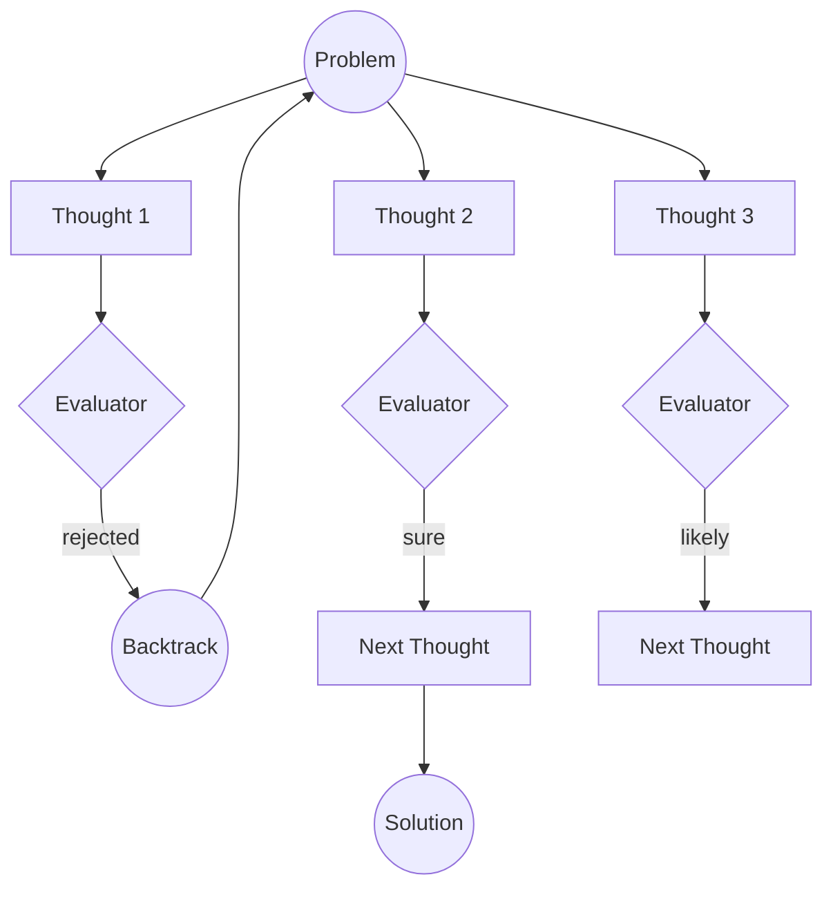

# Tree-of-Thoughts (ToT)

The Tree-of-Thoughts (ToT) pattern is a powerful reasoning framework that enables AI agents to explore multiple reasoning paths in parallel, evaluate their potential, and backtrack when a path leads to a dead end. Unlike linear chain-of-thought, ToT treats problem-solving as a tree search with backtrack option for failure/misunderstanding on-way.

> RavenADK ToT implementation base on paper [Tree of Thoughts: Deliberate Problem Solving
with Large Language Models](https://arxiv.org/pdf/2305.10601)

## Description

Tree-of-Thoughts allows the agent to generate multiple "thoughts" or potential next steps at any given point. These thoughts are then evaluated (either by the same model, a different model, or a programmatic evaluator like `AEval`). Based on the evaluation, the agent decides which branches to continue exploring, which to abandon, and when to backtrack to a previous state to try a different approach.

In RavenADK, ToT is implemented with a strong focus on events, allowing you to monitor backtracks, branch explorations, and evaluations in real-time.

## Motivational questions
### Why?
To get more accuracy from final ai output. You can consider to pair this algorithm with [`RAG`](../augmented%20generation/RAG.md) and [`AEval`](../AEval.md) to check and lift-up groundess as required

### How much?
Incremental increase of accuracy comes with cost of tokens

## Supported Tracking Algorithms
**RavenADK** grants native & adaptive support for 2-ToT native graph-search-algorithms. Both algorithms are use to explore the answers and backtrack when missery is found

* [BFS](https://www.geeksforgeeks.org/dsa/breadth-first-search-or-bfs-for-a-graph/) 
* [DFS](https://www.geeksforgeeks.org/dsa/depth-first-search-or-dfs-for-a-graph/) 
* `GlobalEval` - analyses the options globally to choose the best or continue existsing

> You can choose what algorithm drives exploration and backtracking

## Benefits

- **Non-Linear Reasoning**: Solves complex problems where the first logical step might not be the best one.
- **Self-Correction**: Naturally supports backtracking and re-evaluation of previous decisions.
- **Transparency**: Every branch and evaluation can be captured via events, providing full visibility into the agent's "thinking" process.
- **Higher Accuracy**: By exploring multiple paths, the agent is more likely to find optimal solutions for mathematical, creative, or strategic tasks.

## Pitfalls

- **Cost and Latency**: Exploring multiple branches requires more LLM calls, increasing both token usage and time to reach a final answer. It can be costful by x30 of original
- **State Management**: Keeping track of a growing tree of thoughts can become complex if not managed efficiently.
- **Evaluator Bias**: The quality of the solution depends heavily on the accuracy of the evaluator; a poor evaluation can lead the agent down a wrong path. **We recomend to use capable llms to perform evaluations**

## Use Cases

- **Complex Problem Solving**: When a problem requires strategic planning or has multiple potential solutions (e.g., puzzles, coding architecture).
- **Long Term Planning**: Plan for future with less risks because evaluator by multiple time ensures correcteness of original assumption.
- **Find critical mistakes**: Simulate `Claude Mythos` without Claude Myhtos by utilizing multiple stage-reasoning-phases with backtracking. Works the best with `ReAct` and `CodeAct` patterns.
- **Creative Writing**: Exploring different narrative directions or plot points.
- **Mathematical Reasoning**: Trying different formulas or proof strategies.
- **Strategic Games**: Simulating multiple moves ahead and evaluating the resulting game states.

## Core Components

1. **Runner**: Responsible for generating the next set of thoughts. This can be a simple LLM call or a full [`ReActAgent`](../ReAct-Agent.md).
2. **Evaluator**: A function or agent (like [AEval](../AEval.md)) that reviews generated thoughts and provides a score or verdict.
3. **Events**: The system emits specific events like `backtrack` to allow the parent application to track the search progress.

## How it works (Visualization)

*Note: The `backtrack` event is triggered whenever the agent determines a path is no longer viable and returns to a previous state.*

## Possible combinations
### LLM + RAG

### ReAct Agent
Get best of linear processing `Reasoning -> Acting -> Observation` by identifying and backtracking propagatting faulty reasoning and thoughts

