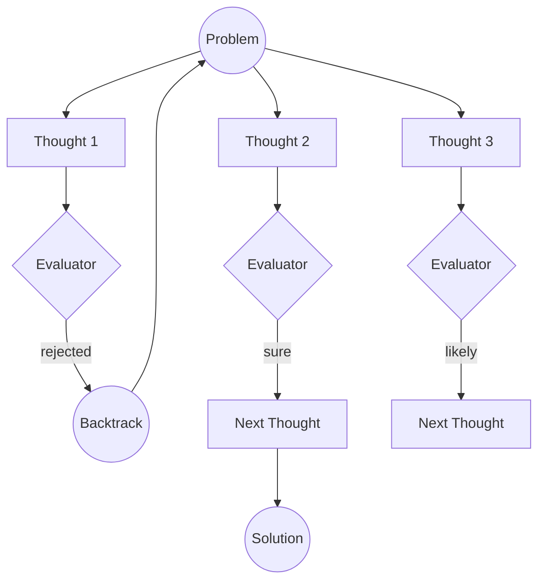

# Tree-of-Thoughts (ToT)

Tree-of-Thoughts (ToT) is a reasoning framework in which an agent explores multiple candidate paths, evaluates them, and backtracks when a path reaches a dead end. Unlike a linear chain of thought, ToT treats problem solving as a tree search: several options can be explored at the same depth, and weaker branches can be abandoned before the search continues.

RavenADK's implementation is based on the paper [Tree of Thoughts: Deliberate Problem Solving with Large Language Models](https://arxiv.org/pdf/2305.10601).

## Overview

At each level, ToT can generate several potential next steps, called thoughts. An evaluator then scores those thoughts. The evaluator may be the same model, a different model, or a programmatic evaluator such as [`AEval`](../AEval.md). The selected search strategy decides which branches to expand, which to prune, and when to backtrack.

RavenADK also emits events for branch exploration, evaluation, and backtracking, so applications can observe the search as it runs.

## Invocation

Choose the invocation method based on the shape required by the caller:

| Method | Use it when | Result |
| --- | --- | --- |
| `invoke()` | A free-form, narrative result is sufficient. | Returns the strategy result with the selected text in `theBestOption.content`. |
| `invokeStructuredOutput(schema, maxRecallTries?)` | The final answer must conform to a Zod schema, such as a plan, specification, course definition, or API response. | Returns parsed values in `theBestOption.zodSchema` and `allOptions[*].zodSchema`. |

### Structured output

Use `invokeStructuredOutput` when the result will be consumed as data rather than displayed only as prose. The supplied schema becomes the output contract for every candidate option. Each strategy generates, evaluates, prunes, and selects options that carry a value matching that schema.

The selected parsed value is available in `result.theBestOption.zodSchema`. The corresponding `content` field remains available for the human-readable explanation or description. Use `invoke()` for exploratory, narrative, or otherwise unstructured results. Use `invokeStructuredOutput` for objects, arrays, enums, and nested records that will be rendered in a UI, stored, passed to another function, or returned from an API.

The optional `maxRecallTries` argument controls how many retries are available for structured option, thought, and evaluator calls:

```typescript
const result = await tot.invokeStructuredOutput(AnswerSchema, 3);
```

Complete example:

```typescript
import { z } from "zod";
import { TreeOfThoughts, BFSToT } from "@ravenlens/raven-adk";

const AnswerSchema = z.object({
    answer: z.string(),
    confidence: z.number()
});

const tot = new TreeOfThoughts({
    query: "Return a structured answer",
    initialOptionsCount: 3,
    graphSearchAlgorithm: new BFSToT({ topK: 1 }),
    optionGenerator,
    thoughtGenerator,
    evaluator
});

const result = await tot.invokeStructuredOutput(AnswerSchema);
const answer = AnswerSchema.parse(result.theBestOption.zodSchema);
```

ToT already validates the value against `AnswerSchema`. Calling `AnswerSchema.parse` again is optional and can be useful when you want to make the validation explicit at the call site.

### Example result

The following is a shortened Node.js console representation of a structured result:

```javascript
{
    theBestOption: {
        id: 'af485d4f-15c8-42ef-8e97-a36baf2d4ce1',
        type: 'option-node',
        content: 'Python - beginner-friendly syntax and a broad ecosystem.',
        zodSchema: { answer: 'Python', confidence: 0.92 },
        initialRate: {
            decision: 'the-best',
            score: 0.92,
            justification: 'Python is a strong general-purpose recommendation for beginners.'
        }
    },
    reasoningChains: [
        { rootOption: [Object], reasoningChain: [Array] }
    ],
    allOptions: [
        {
            id: 'af485d4f-15c8-42ef-8e97-a36baf2d4ce1',
            type: 'option-node',
            content: 'Python - beginner-friendly syntax and a broad ecosystem.',
            zodSchema: [Object],
            initialRate: [Object]
        }
    ]
}
```

`[Object]` and `[Array]` are abbreviated Node.js console representations. They are not literal values in the returned object.

## Result shape

All five search strategies return the same top-level result shape. A strategy can change which optional fields are populated and how much of the reasoning tree is present, but it does not add a different top-level field.

### Top-level fields

| Field | Shape | Meaning |
| --- | --- | --- |
| `theBestOption` | `OptionNode` | The selected root option. With `invokeStructuredOutput`, `zodSchema` contains the value parsed by the caller's Zod schema. |
| `reasoningChains` | `{ rootOption, reasoningChain }[]` | The explored or retained reasoning trees. `rootOption` is the root `OptionNode`; `reasoningChain` is a recursive tuple of thoughts and their child chains. |
| `allOptions` | `OptionNode[]` | All initially generated root options, including options later pruned by the strategy. |

### `OptionNode` fields

| Field | Meaning | When it is present |
| --- | --- | --- |
| `id` | Unique option identifier used to connect a result to its reasoning tree. | Every generated option. |
| `type` | The literal value `"option-node"`. | Every option. |
| `content` | Human-readable explanation of the candidate option. | Every option. It remains available when `zodSchema` is used. |
| `zodSchema` | The parsed structured value, not the Zod schema object itself. | After a successful `invokeStructuredOutput(...)` for `theBestOption` and every entry in `allOptions`; optional when using `invoke()`. |
| `initialRate` | The first evaluator result: `decision`, `score`, and `justification`. | Normally present on initial options for BFS, DFS, Best-First, Multi-Beam, and MCTS. It can be absent when an evaluator does not return a matching rating. |
| `finalRate` | A later evaluator result for the complete candidate path. | Assigned by `MultiBeamToT` during normal final scoring. BFS, DFS, Best-First, and MCTS do not assign this field. Early exits skip Multi-Beam's final-scoring phase. |
| `justification` | An explanation for why an option was selected. | Optional. Multi-Beam's final selector explicitly requests it; other strategies may return it when their model response includes it. Callers should not assume it is always present. |

The `Rate` object used by `initialRate`, `finalRate`, and thought `rate` contains:

| Field | Meaning |
| --- | --- |
| `decision` | `"good"`, `"the-best"`, or `"declined"`. |
| `score` | Numeric evaluation score. |
| `justification` | The evaluator's reason for the score and decision. |

### `reasoningChains` structure

Each `reasoningChain` is represented as `[thoughts, childChains]`:

- `thoughts` is an array of `ThoughtNode` values at the next depth.
- `childChains` is an array of recursive chains for those thoughts, or `null` at a leaf. Initial early exits use `[[], null]` because no thought was explored.
- A `ThoughtNode` contains `id`, `type: "though-node"` (the current API spelling), `content`, an optional `rate`, and `dependingThoughNodes` containing linked child thoughts.

### Strategy-specific outcomes

| Strategy | `theBestOption` selection | `reasoningChains` and rate behavior |
| --- | --- | --- |
| `BFSToT` | Returns the initial option on an option-level early exit, the parent root on a thought-level early exit, or an evaluator-selected option from the surviving global top-$K$ paths. | Normal chains are built only for globally surviving roots. Initial options receive `initialRate`; thoughts receive `rate`. The strategy does not assign `finalRate`. |
| `DFSToT` | Returns the initial option on an early exit. Otherwise, it asks the evaluator to choose among successful paths and falls back to the highest initially rated option when no path succeeds. | Normal chains represent paths that reached the depth limit or triggered early exit. If no successful path exists, `reasoningChains` can be empty even when `allOptions` and `theBestOption` are returned. Initial options receive `initialRate`; thoughts receive `rate`. |
| `BestFirstToT` | Returns the best frontier root on an early exit. Otherwise, it asks the evaluator to choose from finished paths. | Chains represent finished frontier paths, with a root-only fallback when no finished path was recorded. Initial options receive `initialRate`; expanded thoughts receive `rate`. The strategy does not assign `finalRate`. |
| `MultiBeamToT` | Returns the initial root or the root belonging to an early-exit thought. Otherwise, it asks a final evaluator to select the best beam and explicitly requests `justification`. | Normal chains represent the retained beams. Initial options receive `initialRate`, thoughts are rated according to `evaluateAfterThoughtTreeLevel`, and roots receive `finalRate` during normal final scoring. Early exits use the shorter chain form and skip final scoring. |
| `MCTSToT` | Selects the initial option with the highest visit count after its simulations. MCTS does not use `earlyExitThreshold` or a final evaluator-selection call. | A chain is returned for every initial option. With zero iterations, those chains are root-only (`[[], null]`). Initial options receive `initialRate`; expanded thoughts receive `rate`. The strategy does not assign `finalRate`. |

The stable contract is the three top-level fields and the shared `OptionNode` and `ReasoningChain` shapes. Strategy-specific differences are optional nested fields and chain contents, not alternative result object schemas.

## Why use ToT?

ToT can improve the quality of the final answer by exploring and comparing multiple candidate paths. It is especially useful when the problem has several plausible approaches, when an early assumption may be wrong, or when the evaluator can identify weak intermediate steps.

The additional exploration increases token usage and latency. Tune the number of initial options, thoughts per level, search depth, and strategy-specific limits to balance quality and cost. ToT also combines well with [`RAG`](../augmented%20generation/RAG.md) for factual grounding and [`AEval`](../AEval.md) for evaluation.

## Search strategies

RavenADK supports five graph-search strategies. They use the same ToT building blocks but differ in how they prioritize, retain, and revisit candidate paths.

### Shared defaults

Unless overridden in the `TreeOfThoughts` configuration:

- `maxThoughtsDepth`: Maximum number of thought levels. The default is **10**.
- `thoughtsCount`: Number of thoughts generated at each level. The default is **3**.

### 1. Multi-Beam Search (`MultiBeamToT`)

Multi-Beam Search maintains several independent reasoning "beams" that compete globally at each level. Each beam is rooted in an initial option and maintains its own specialized context.

**How it works:**

1. **Initial generation:** Generate `initialOptionsCount` options with `optionGenerator`.
2. **Optional initial pruning:** When `pruneAtBegining` is enabled, evaluate the initial options and use only the top `topK` options as beam roots.
3. **Beam expansion:** For each active beam:
    - Generate `thoughtsCount` thoughts with `thoughtGenerator`.
    - Starting at `evaluateAfterThoughtTreeLevel`, evaluate each thought using the full established path as context. If a thought reaches `earlyExitThreshold`, return its root immediately.
    - Keep the top `topK` thoughts in that beam.
    - Repeat until `maxThoughtsDepth` is reached. `evaluateAfterThoughtTreeLevel` cannot be greater than `maxThoughtsDepth`.
4. **Final selection:** Evaluate the completed beam paths and select the best `theBestOption`.

**Strengths**

* **High Diversity**: By preserving $K$ independent seeds, it prevents the search from prematurely converging on a single path.
* **Context Awareness**: Prompts included the "Established Path" for each specific beam, allowing the LLM to maintain deep topical consistency.
* **Backtrack Stability**: Since beams are conceptually distinct, failing one beam doesn't necessarily poison the evaluation of others.

**Trade-offs**

* **Token Overhead**: Detailed context-rich prompts for each beam increase input token consumption.
* **Rigidity**: A slightly inferior but valid branch might be pruned because it doesn't "outperform" a very strong (but potentially dead-end) path early on.

**Good fits**

* **Strategic Advisory**: When you need $K$ distinct battle plans or business strategies where each must be internally consistent.
* **Creative Writing**: Developing multiple different plot twists where each must follow its own logic.
* **Learning Path Design**: Generating coherent, longitudinal educational roadmaps.

**Example**

```typescript
import { TreeOfThoughts, MultiBeamToT } from "@ravenlens/raven-adk";

const tot = new TreeOfThoughts({
    query: "Design a multi-planetary migration strategy for humanity",
    initialOptionsCount: 5,
    thoughtsCount: 3,
    maxThoughtsDepth: 5,
    earlyExitThreshold: 0.7, // Optional early exit for a high-scoring branch
    graphSearchAlgorithm: new MultiBeamToT({
        topK: 3,                           // Maintain 3 independent beams
        pruneAtBegining: true,            // Evaluate initial options before starting beams
        evaluateAfterThoughtTreeLevel: 2  // Start evaluating thoughts at level 2
    }),
    optionGenerator: myAgent,
    thoughtGenerator: myAgent,
    evaluator: myEvaluatorAgent
});
```

***

### 2. Breadth-First Search (`BFSToT`)

True BFS expands the reasoning frontier level-by-level. At every step, all potential thoughts from all active branches are pooled and the top $K$ are selected globally.

**How it works:**

1. **Initial generation:** Generate `initialOptionsCount` options with `optionGenerator`.
2. **Initial pruning:** Evaluate the options and keep the globally best `topK` options in the frontier.
3. **Level-by-level expansion:**
    - For every node in the current frontier, generate `thoughtsCount` thoughts.
    - Gather all new thoughts from all parents into one pool.
    - Use the `evaluator` to keep the top `topK` thoughts, regardless of their parent branch.
    - Use the selected thoughts as the frontier for the next level.
    - Repeat until `maxThoughtsDepth` is reached.
4. **Final selection:** Select the best surviving path from the final frontier.

**Strengths**

* **Global Efficiency**: Ensures that for any depth $D$, we are following the $K$ absolute best thoughts found so far, regardless of which root they came from.
* **Resource Focused**: Concentrates all reasoning power on the highest-gradient paths.
* **Simple Heuristics**: Easier for evaluators to compare "apples to apples" when all thoughts are at the same logical depth.

**Trade-offs**

* **Low Diversity (Convergence Risk)**: One exceptionally high-scoring branch can "suffocate" others, often leading to $K$ near-identical paths.
* **Context Loss**: As paths are pooled, the shared context becomes more generic compared to the targeted beams of Multi-Beam search.

**Good fits**

* **Optimization Problems**: Finding the shortest or most efficient path to a technical solution (e.g., code optimization).
* **Fact-Checking**: Exhaustively checking all immediate claims in a text before proceeding to deeper implications.

**Example**

```typescript
import { TreeOfThoughts, BFSToT } from "@ravenlens/raven-adk";

const tot = new TreeOfThoughts({
    query: "Find the most efficient route for a delivery drone in a dense city",
    initialOptionsCount: 10,
    thoughtsCount: 5,
    maxThoughtsDepth: 4,
    graphSearchAlgorithm: new BFSToT({
        topK: 3 // Keep only the top 3 thoughts across the frontier at each level
    }),
    optionGenerator: myAgent,
    thoughtGenerator: myAgent,
    evaluator: myEvaluatorAgent
});
```

***

### 3. Depth-First Search (`DFSToT`)

Depth-First Search (DFS) focuses on exploring a single reasoning path as deeply as possible before backtracking. It uses a `threshold` to decide when a path is "good enough" to continue or if it should backtrack immediately.

**How it works:**

1. **Initial generation:** Generate and evaluate `initialOptionsCount` options.
2. **Recursive depth search:** Visit options in order, starting with the first one:
    - Generate `thoughtsCount` thoughts for the current node.
    - Evaluate the new thoughts.
    - Keep only thoughts with a score $\ge$ `threshold`.
    - If several thoughts pass, follow the first one and continue recursively.
    - If no thought passes, or `maxThoughtsDepth` is reached, backtrack and try the next valid sibling.
3. **Success tracking:** Record paths that reach `maxThoughtsDepth` with scores above the threshold.
4. **Final selection:** Ask the evaluator to choose among successful paths. If no path succeeds, return the highest initially rated option.

**Strengths**

* **Memory Efficiency**: Only stores the current path in active memory, making it highly efficient for deep search trees ($O(\text{Depth})$).
* **Specialization**: Excellent for problems requiring deep, focused investigation into a single specialized niche.
* **Fast Discovery**: If the successful path is located deep in the first few branches, DFS finds it much faster than BFS or Multi-Beam.

**Trade-offs**

* **Local Minima Risk**: Can get stuck exploring a very deep, high-scoring (but ultimately wrong) branch for a long time.
* **High Latency for Failures**: If the solution is in the last branch, DFS will explore every other branch to its full depth first.
* **Threshold Sensitivity**: Highly dependent on the `threshold` parameter; too high and it backtracks constantly, too low and it follows dead ends.

**Good fits**

* **Scientific Discovery**: Deeply investigating a single hypothesis to its logical conclusion.
* **Legal Reasoning**: Following a specific legal precedent through all its implications and sub-clauses.

**Example**

```typescript
import { TreeOfThoughts, DFSToT } from "@ravenlens/raven-adk";

const tot = new TreeOfThoughts({
    query: "Determine the root cause of a specific complex software bug",
    initialOptionsCount: 3,
    thoughtsCount: 2,
    maxThoughtsDepth: 10,
    graphSearchAlgorithm: new DFSToT(
        0.8 // Threshold: only continue if the thought scores 0.8 or higher
    ),
    optionGenerator: myAgent,
    thoughtGenerator: myAgent,
    evaluator: myEvaluatorAgent
});
```

***

### 4. Best-First Search (`BestFirstToT`)

Best-First Search maintains a global frontier of all unexpanded thoughts and always chooses to expand the node with the highest heuristic score from the evaluator, regardless of its depth.

**How it works:**

1. **Initial generation:** Generate `initialOptionsCount` options with `optionGenerator`.
2. **Initial rating:** Evaluate all options with `evaluator`.
3. **Frontier initialization:** Add the rated options to a priority queue, ordered by score.
4. **Best-first loop:**
    - Remove the highest-scoring node from the queue.
    - If its score is $\ge$ `earlyExitThreshold`, return its path immediately.
    - If its depth is below `maxThoughtsDepth`, generate `thoughtsCount` new thoughts.
    - Rate the new thoughts and add those with a score $\ge$ `acceptanceTreshold` to the queue.
    - Continue with whichever branch currently has the highest score. The next branch can have a different depth or root.
5. **Final selection:** If the queue is empty or a limit is reached, ask the evaluator to choose among the finished reasoning chains.

**Strengths**

* **Dynamic Prioritization**: Focuses computational effort on the most "promising" paths globally across the entire tree.
* **Efficiency**: Avoids expanding siblings of a high-scoring thought if that thought itself is progressing well.
* **Branch Switching**: If a deep path starts to decline in quality, the algorithm naturally "jumps" back to a more promising shallow branch.

**Trade-offs**

* **Evaluator Dependency**: Extremely sensitive to the evaluator's quality; a single "hallucinated" high score can derail the search.
* **Exploration Bias**: May ignore valid but "average-starting" branches in favor of a single branch that starts strong but leads to a dead end.

**Good fits**

* **Game AI**: Finding the best move in complex state-space trees where some moves are clearly superior.
* **Medical Diagnosis**: Following the most likely symptom-to-disease paths while leaving other hypotheses open.
* **Financial Modeling**: Exploring the most profitable investment sequences in parallel.

**Configuration**

`BestFirstToT` uses the shared `TreeOfThoughtsConfig` parameters. Unlike Multi-Beam, which tracks independent beams, Best-First treats the tree as one global pool:

* `maxThoughtsDepth`: Caps the length of any single branch.
* `earlyExitThreshold`: Allows for high-confidence short-circuiting.
* `thoughtsCount`: Determines the branching factor at each expansion step.
* `initialOptionsCount`: Sets the starting breadth at Level 0.

**Example**

```typescript
import { TreeOfThoughts, BestFirstToT } from "@ravenlens/raven-adk";

const tot = new TreeOfThoughts({
    query: "Optimize the supply chain logistics for a global retail chain",
    initialOptionsCount: 5,
    thoughtsCount: 3,
    maxThoughtsDepth: 8,
    earlyExitThreshold: 0.95,
    graphSearchAlgorithm: new BestFirstToT({
        acceptanceTreshold: 0.6 // Minimum score to keep a thought in the frontier
    }),
    optionGenerator: myAgent,
    thoughtGenerator: myAgent,
    evaluator: myEvaluatorAgent
});

const result = await tot.invoke();
```

***

### 5. Monte Carlo Tree Search (`MCTSToT`)

Monte Carlo Tree Search (MCTS) is a probabilistic search algorithm that balances exploration and exploitation using the **Upper Confidence Bound for Trees (UCT)**. It is particularly effective for large, non-deterministic reasoning spaces.

**How it works:**

1. **Selection:** Starting at the root, select the most promising child using the UCT formula until a leaf is reached.
2. **Expansion:** If the leaf is not terminal and has not reached `maxThoughtsDepth`, generate `thoughtsCount` new thoughts.
3. **Simulation:** Use the `evaluator` to assign an initial quality score to the newly expanded node.
4. **Backpropagation:** Propagate the score, optionally adjusted by `depthPenalty`, through the node's ancestors and update their visit counts and total values.
5. **Iteration:** Repeat the process for the configured number of `iterations`.
6. **Final selection:** Select the root with the highest visit count as the winning option.

**The UCT Formula**

MCTS uses the **Upper Confidence Bound** to decide which node to explore next:

$$UCT = \frac{V_i}{n_i} + C \times \sqrt{\frac{\ln(N)}{n_i}}$$

where:

* $\frac{V_i}{n_i}$ is the **exploitation** term: the node's average value (`value / visits`).
* $C \times \sqrt{\frac{\ln(N)}{n_i}}$ is the **exploration** term, which favors nodes with fewer visits.
* $C$ is `explorationConstant`.
* $n_i$ is the number of visits to the current node.
* $N$ is the total number of visits to the parent node.

**Configuration Parameters**

* **`iterations`**: The total number of simulation cycles. More iterations lead to better convergence but increase token costs. Default is **30**.
* **`explorationConstant (C)`**:
  * **Higher values (> 1.41)** favor **exploration** (trying new, unvisited branches).
  * **Lower values (< 1.41)** favor **exploitation** (focusing on branches that already have high scores).
* **`depthPenalty`**: A penalty subtracted from the backpropagated value based on depth. This encourages shorter reasoning paths. Use a floating-point value such as `0.01` to `1.00`.

> **Note**: MCTS is the only strategy that **does not use** the `earlyExitThreshold` parameter. It relies entirely on the statistical convergence over its defined `iterations`.

**Strengths**

* **Balanced Search**: Automatically balances trying new ideas vs. refining existing ones.
* **Asymmetric Tree Growth**: Focuses heavily on promising branches while still maintaining a statistical map of alternatives.
* **Efficiency**: Use `depthPenalty` to prevent "rambling" and find concise solutions.

**Trade-offs**

* **High Latency**: Requires a significant number of iterations to become statistically significant.
* **Costly**: Each expansion and simulation step involves LLM calls.

**Good fits**

* **Policy Making**: Simulating complex social or economic impacts where multiple variables interact.
* **Coding Architecture**: Exploring different design patterns and their downstream implications.

**Example**

```typescript
import { TreeOfThoughts, MCTSToT } from "@ravenlens/raven-adk";

const tot = new TreeOfThoughts({
    query: "Develop a consensus protocol for a decentralized autonomous organization",
    initialOptionsCount: 3,
    thoughtsCount: 2,
    maxThoughtsDepth: 6,
    graphSearchAlgorithm: new MCTSToT({
        iterations: 25,         // Run 25 simulation cycles
        explorationConstant: 1.414, // Standard UCT exploration bias
        depthPenalty: 0.05      // Penalize longer paths by 0.05 per step
    }),
    optionGenerator: myAgent,
    thoughtGenerator: myAgent,
    evaluator: myEvaluatorAgent
});
```

## Strategy comparison

The following table summarizes the typical search profile of each strategy. The exact number of model calls and retained nodes depends on the configured depth, branching factor, pruning limits, and evaluator behavior.

| Feature | Multi-Beam | BFS | DFS | Best-First | MCTS |
| --- | --- | --- | --- | --- | --- |
| Search pattern | Independent beams | Global level-by-level frontier | One path at a time with backtracking | Global priority queue | Iterative UCT simulations |
| Space profile | $O(K \cdot D)$ | $O(K \cdot D)$ | $O(D)$ active path | Depends on the frontier | $O(N)$ visited nodes |
| Pruning | Top $K$ within each beam | Global top $K$ | Score threshold | Acceptance threshold | UCT selection |
| Early exit | Yes (`earlyExitThreshold`) | Yes (`earlyExitThreshold`) | Yes (`earlyExitThreshold`) | Yes (`earlyExitThreshold`) | No |

### Exploration and exploitation

- **Multi-Beam** preserves several independent directions and helps avoid premature convergence.
- **BFS** applies greedy global pruning at each depth, which is effective when candidates at the same level are easy to compare.
- **DFS** favors depth over breadth. It uses little active memory but can miss a better branch when its threshold is poorly tuned.
- **Best-First** expands the highest-scoring available node, so it can switch between branches and depths as scores change.
- **MCTS** uses statistical simulation to balance exploration and exploitation. It is useful when the search space is too large for exhaustive exploration and evaluator scores are uncertain.

## Early exit

Strategies that support `earlyExitThreshold` can stop as soon as an option or thought receives a score greater than or equal to that threshold. MCTS does not use early exit; it relies on its configured number of simulations.

When early exit occurs:

- The current branch is returned as the winning path.
- Remaining expansions are skipped, reducing token usage and latency.
- The result is built from the high-scoring path discovered so far.

Early exit is useful when a satisfactory answer may appear in the first few levels, when latency matters, or when a deep search would cost more than the expected quality improvement.

## Case study: generating learning paths

For educational curricula and professional roadmaps, **Multi-Beam Search (`MultiBeamToT`)** is often a good starting point.

Multi-Beam is a good fit because:

1. **It preserves consistency.** Each beam keeps its established path, so a route that begins with game development is less likely to drift into unrelated prerequisites.
2. **It supports variety.** With $K$ beams, the search can produce distinct styles such as visual/project-based, mathematical/theoretical, and fast-track learning paths.
3. **It keeps prerequisites contextual.** Each step is evaluated against the path that led to it rather than against a pooled frontier alone.

### Comparison for educational use

| Feature | Multi-Beam | BFS | DFS | Best-First | MCTS |
| --- | --- | --- | --- | --- | --- |
| Consistency | High | Low to medium | Medium, with local-minimum risk | Medium, with possible topic switching | High for simulated paths |
| Result variety | $K$ distinct versions | One average version | One deep version | One highest-priority path | One statistically favored path |
| Prerequisite coverage | Balanced | High raw coverage | Can skip basics | Follows high-scoring dependencies | Strong when iterations are sufficient |

## Summary

ToT is most useful when a problem benefits from comparing alternatives, evaluating intermediate steps, or recovering from a weak assumption. Each strategy applies a different search policy, but all of them expose the same result shape.

### Benefits

- **Non-linear reasoning:** Explore several candidate approaches instead of committing to the first step.
- **Self-correction:** Backtrack and reevaluate branches that stop looking promising.
- **Transparency:** Observe branch exploration and evaluation through emitted events.
- **Higher answer quality:** Increase the chance of finding a strong solution for complex, creative, mathematical, or strategic tasks.

### Trade-offs

- **Cost and latency:** Exploring multiple branches requires more model calls, tokens, and time than a single-pass response.
- **State management:** A large reasoning tree requires careful control of depth, branching, and retained paths.
- **Evaluator bias:** A weak or inconsistent evaluator can cause the search to prune a useful branch or favor a misleading one. Use a capable evaluator and tune the search parameters for the task.

### Common use cases

- **Complex problem solving:** Compare approaches to puzzles, technical designs, and architecture decisions.
- **Long-term planning:** Evaluate multiple plans and their consequences before choosing a direction.
- **Critical-error detection:** Use staged reasoning and backtracking to uncover mistakes in complex work. ToT pairs well with `ReAct` and `CodeAct` for this type of workflow.
- **Creative writing:** Explore different narrative directions or plot points.
- **Mathematical reasoning:** Try multiple formulas, derivations, or proof strategies.
- **Strategic games:** Simulate several moves ahead and evaluate the resulting states.

### Core components

1. **Option generator:** Produces the initial candidate options. It can be a simple model call or a full [`ReActAgent`](../ReAct-Agent.md).
2. **Thought generator:** Expands a selected option with possible next steps.
3. **Evaluator:** Reviews options or thoughts and returns a score, decision, and justification. It can be a model or a programmatic evaluator such as [`AEval`](../AEval.md).
4. **Events:** Emits events such as `backtrack` so the parent application can observe search progress.

### Visualization



_Note: The `backtrack` event is triggered whenever the agent determines that a path is no longer viable and returns to a previous state._

## Combining ToT with other patterns

### ToT + RAG (Resource-Augmented Generation)

Combine ToT's alternative-path search with RAG's factual grounding. This is especially useful for the `evaluator` and `thoughtGenerator` units.

1. **Grounded evaluation:** Use a RAG-enabled `evaluator` to score thoughts against a verified knowledge base. This helps prevent the search from following branches that sound logical but are not supported by the available facts.
2. **Contextual expansion:** Use RAG in the `thoughtGenerator` to provide relevant technical documentation or business rules before generating the next thought.
3. **Query generation:** Use ToT to generate and compare candidate search queries, then use RAG to retrieve content for the selected paths.

```typescript
const ragEvaluator = new ResourceAugmentedGeneration({
    query: "Evaluate the technical feasibility of this thought",
    database: myKnowledgeBase,
    model: embeddingModel
}).register(evaluatorAgent);

const tot = new TreeOfThoughts({
    // ...
    evaluator: ragEvaluator // The evaluator now has access to your private data
});
```

### ToT + ReAct Agent

Using a full `ReActAgent` as the `thoughtGenerator` or `optionGenerator` creates a nested reasoning workflow.

- **Deep reasoning:** Each thought can be the result of a ReAct loop (reasoning -> acting -> observation), allowing branches to use real tool outputs.
- **Recovery from failed actions:** If a tool call leads to a weak result, the evaluator can assign a low score and ToT can backtrack to a different branch.
- **Parallel problem solving:** `MultiBeamToT` can run several tool-based strategies in parallel, with each beam maintaining its own context.

```typescript
import { TreeOfThoughts, MultiBeamToT, ReActAgent, OpenAI } from "@ravenlens/raven-adk";

const toolUsingAgent = new ReActAgent({
    model: new OpenAI({ model: "gpt-5", apiKey: process.env.OPENAI_API_KEY }),
    tools: [googleSearch, mathematicalCalculator],
    withConclusion: false // Usually better for intermediate thought generation
});

const tot = new TreeOfThoughts({
    query: "Investigate and solve the performance bottleneck in the legacy codebase",
    thoughtGenerator: toolUsingAgent, // Each node expansion uses tools to verify info
    optionGenerator: toolUsingAgent,
    evaluator: myEvaluator,
    graphSearchAlgorithm: new MultiBeamToT({ topK: 3 })
});

const result = await tot.invoke();
```
