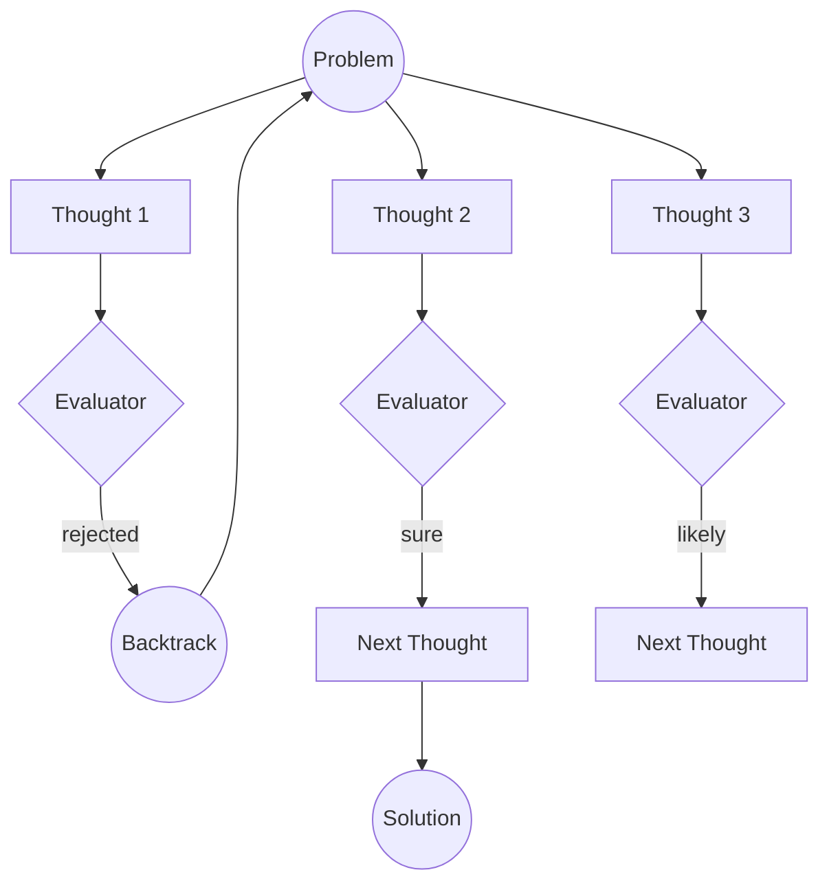

# Tree-of-Thoughts (ToT)

The Tree-of-Thoughts (ToT) pattern is a powerful reasoning framework that enables AI agents to explore multiple reasoning paths in parallel, evaluate their potential, and backtrack when a path leads to a dead end. Unlike linear chain-of-thought, ToT treats problem-solving as a tree search with backtrack option for failure/misunderstanding on-way.

> RavenADK ToT implementation base on paper [Tree of Thoughts: Deliberate Problem Solving
with Large Language Models](https://arxiv.org/pdf/2305.10601)

## Description

Tree-of-Thoughts allows the agent to generate multiple "thoughts" or potential next steps at any given point. These thoughts are then evaluated (either by the same model, a different model, or a programmatic evaluator like `AEval`). Based on the evaluation, the agent decides which branches to continue exploring, which to abandon, and when to backtrack to a previous state to try a different approach.

In RavenADK, ToT is implemented with a strong focus on events, allowing you to monitor backtracks, branch explorations, and evaluations in real-time.

## Motivational questions
### Why?
To get more accuracy from final ai output. You can consider to pair this algorithm with [`RAG`](../augmented%20generation/RAG.md) and [`AEval`](../AEval.md) to check and lift-up groundess as required

### How much?
Incremental increase of accuracy comes with cost of tokens

## Supported Search Strategies
**RavenADK** supports two primary graph-search strategies for exploring the reasoning tree. Each strategy balances diversity and efficiency differently.

### 1. Multi-Beam Search (`MultiBeamToT`)
Multi-Beam Search maintains several independent reasoning "beams" that compete globally at each level. Each beam is rooted in an initial option and maintains its own specialized context.

#### Pros
- **High Diversity**: By preserving $K$ independent seeds, it prevents the search from prematurely converging on a single path.
- **Context Awareness**: Prompts included the "Established Path" for each specific beam, allowing the LLM to maintain deep topical consistency.
- **Backtrack Stability**: Since beams are conceptually distinct, failing one beam doesn't necessarily poison the evaluation of others.

#### Cons
- **Token Overhead**: Detailed context-rich prompts for each beam increase input token consumption.
- **Rigidity**: A slightly inferior but valid branch might be pruned because it doesn't "outperform" a very strong (but potentially dead-end) path early on.

#### Real-World Applications
- **Strategic Advisory**: When you need $K$ distinct battle plans or business strategies where each must be internally consistent.
- **Creative Writing**: Developing multiple different plot twists where each must follow its own logic.
- **Learning Path Design**: Generating coherent, longitudinal educational roadmaps.

---

### 2. Breadth-First Search (`BFSToT`)
True BFS expands the reasoning frontier level-by-level. At every step, all potential thoughts from all active branches are pooled and the top $K$ are selected globally.

#### Pros
- **Global Efficiency**: Ensures that for any depth $D$, we are following the $K$ absolute best thoughts found so far, regardless of which root they came from.
- **Resource Focused**: Concentrates all reasoning power on the highest-gradient paths.
- **Simple Heuristics**: Easier for evaluators to compare "apples to apples" when all thoughts are at the same logical depth.

#### Cons
- **Low Diversity (Convergence Risk)**: One exceptionally high-scoring branch can "suffocate" others, often leading to $K$ near-identical paths.
- **Context Loss**: As paths are pooled, the shared context becomes more generic compared to the targeted beams of Multi-Beam search.

#### Real-World Applications
- **Optimization Problems**: Finding the shortest or most efficient path to a technical solution (e.g., code optimization).
- **Fact-Checking**: Exhaustively checking all immediate claims in a text before proceeding to deeper implications.

---

### 3. Depth-First Search (`DFSToT`)
Depth-First Search (DFS) focuses on exploring a single reasoning path as deeply as possible before backtracking. It uses a `threshold` to decide when a path is "good enough" to continue or if it should backtrack immediately.

#### Pros
- **Memory Efficiency**: Only stores the current path in active memory, making it highly efficient for deep search trees ($O(\text{Depth})$).
- **Specialization**: Excellent for problems requiring deep, focused investigation into a single specialized niche.
- **Fast Discovery**: If the successful path is located deep in the first few branches, DFS finds it much faster than BFS or Multi-Beam.

#### Cons
- **Local Minima Risk**: Can get stuck exploring a very deep, high-scoring (but ultimately wrong) branch for a long time.
- **High Latency for Failures**: If the solution is in the last branch, DFS will explore every other branch to its full depth first.
- **Threshold Sensitivity**: Highly dependent on the `threshold` parameter; too high and it backtracks constantly, too low and it follows dead ends.

#### Real-World Applications
- **Scientific Discovery**: Deeply investigating a single hypothesis to its logical conclusion.
- **Legal Reasoning**: Following a specific legal precedent through all its implications and sub-clauses.

---

## Mathematical Comparison

Regarding the search complexity and search space:

| Feature | Multi-Beam Search | BFS | DFS |
| :--- | :--- | :--- | :--- |
| **Expansion Formula** | $K \times \text{Depth}$ (Independent tracks) | $\text{Frontier} \times \text{Width}$ (Global Pool) | Single branch recursion |
| **Space Complexity** | $O(K \cdot D)$ | $O(K \cdot D)$ | $O(D)$ |
| **Convergence Rate** | Slow (High exploration) | Fast (High exploitation) | Variable (Path-dependent) |
| **Pruning Logic** | Competitive across fixed tracks | Pure global top-K selection | Threshold-based backtracking |
| **Early Exit Support** | Yes (`earlyExitThreshold`) | Yes (`earlyExitThreshold`) | Yes (`earlyExitThreshold`) |

**Exploration vs. Exploitation**: 
- **Multi-Beam** acts as a multi-modal explorer, avoiding premature convergence.
- **BFS** is a greedy frontier expansion, optimal for simple search landscapes.
- **DFS** is a "deep-diver". It sacrifices breadth for depth, making it the most memory-efficient but also the most prone to missing global optima if not tuned with the correct threshold.

---

### Efficiency Feature: Early Exit (Short-Circuiting)

RavenADK supports an **Early Exit** mechanism via the `earlyExitThreshold` parameter.

#### How it works:
If any **Option** or **Thought** receives a score from the evaluator that is **greater than or equal** to the `earlyExitThreshold`, the search process terminates immediately. 
- The current branch is treated as the "Winning Path".
- All remaining expansions are skipped to save tokens and time.
- The system proceeds directly to generating the final result based on the discovered high-quality path.

#### Use Cases:
- **Known Solutions**: When there's a possibility the model finds the answer in the first 2-3 levels.
- **Cost Optimization**: Drastically reduces token usage in deep trees.
- **Low Latency**: Returns the answer as soon as "good enough" evidence is found.

---

### Case Study: Generating Learning Paths

When generating educational curricula or professional roadmaps, **Multi-Beam Search (`MultiBeamToT`)** is the recommended strategy.

#### Why Multi-Beam?
1.  **Longitudinal Consistency**: A learning path requires a narrative thread. Multi-Beam preserves the "Established Path" for each beam, ensuring that if it starts a "Game Development" route, it doesn't accidentally pivot to unrelated "Web Dev" prerequisites (a common issue in global BFS pooling).
2.  **Pedagogical Diversity**: By initializing $K$ beams, you can generate distinct styles (e.g., "Visual/Project-based," "Mathematical/Theoretical," and "Fast-track") simultaneously.
3.  **Prerequisite Mapping**: The threshold-based evaluation in independent beams ensures that each step is a logical successor to the previous one within its specific context.

##### Comparison for Educational Use
| Feature | Multi-Beam (Winner) | BFS | DFS |
| :--- | :--- | :--- | :--- |
| **Consistency** | **High** (Stays on topic) | Low (Context mixing) | Med (Prone to local minima) |
| **Student Choice** | **$K$ distinct versions** | 1 "Average" version | 1 "Deep" version |
| **Prerequisites** | Balanced | Best at raw coverage | Poor (Might skip basics) |

---

# ToT Overall Sumup

**Crucial Note: In all strategies, the final "Winner" is determined by evaluating the entire Reasoning Chain (the full path from problem to solution), ensuring that the final output is backed by a logically sound and consistent history of thoughts.**

## Benefits

- **Non-Linear Reasoning**: Solves complex problems where the first logical step might not be the best one.
- **Self-Correction**: Naturally supports backtracking and re-evaluation of previous decisions.
- **Transparency**: Every branch and evaluation can be captured via events, providing full visibility into the agent's "thinking" process.
- **Higher Accuracy**: By exploring multiple paths, the agent is more likely to find optimal solutions for mathematical, creative, or strategic tasks.

## Pitfalls

- **Cost and Latency**: Exploring multiple branches requires more LLM calls, increasing both token usage and time to reach a final answer. It can be costful by x30 of original
- **State Management**: Keeping track of a growing tree of thoughts can become complex if not managed efficiently.
- **Evaluator Bias**: The quality of the solution depends heavily on the accuracy of the evaluator; a poor evaluation can lead the agent down a wrong path. **We recomend to use capable llms to perform evaluations**

## Use Cases

- **Complex Problem Solving**: When a problem requires strategic planning or has multiple potential solutions (e.g., puzzles, coding architecture).
- **Long Term Planning**: Plan for future with less risks because evaluator by multiple time ensures correcteness of original assumption.
- **Find critical mistakes**: Simulate `Claude Mythos` without Claude Myhtos by utilizing multiple stage-reasoning-phases with backtracking. Works the best with `ReAct` and `CodeAct` patterns.
- **Creative Writing**: Exploring different narrative directions or plot points.
- **Mathematical Reasoning**: Trying different formulas or proof strategies.
- **Strategic Games**: Simulating multiple moves ahead and evaluating the resulting game states.

## Core Components

1. **Runner**: Responsible for generating the next set of thoughts. This can be a simple LLM call or a full [`ReActAgent`](../ReAct-Agent.md).
2. **Evaluator**: A function or agent (like [AEval](../AEval.md)) that reviews generated thoughts and provides a score or verdict.
3. **Events**: The system emits specific events like `backtrack` to allow the parent application to track the search progress.

## How it works (Visualization)

*Note: The `backtrack` event is triggered whenever the agent determines a path is no longer viable and returns to a previous state.*

## Possible combinations
### LLM + RAG

### ReAct Agent
Get best of linear processing `Reasoning -> Acting -> Observation` by identifying and backtracking propagatting faulty reasoning and thoughts

