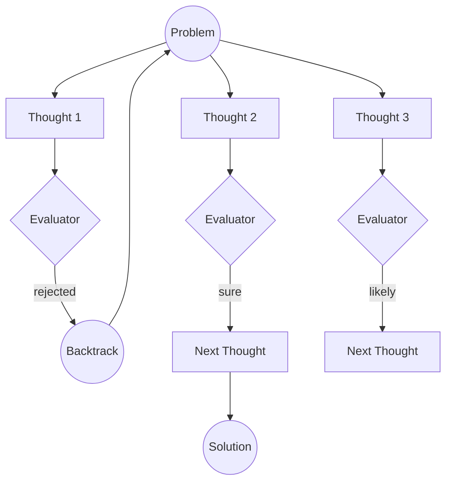

# Tree-of-Thoughts (ToT)

The Tree-of-Thoughts (ToT) pattern is a powerful reasoning framework that enables AI agents to explore multiple reasoning paths in parallel, evaluate their potential, and backtrack when a path leads to a dead end. Unlike linear chain-of-thought, ToT treats problem-solving as a tree search with backtrack option for failure/misunderstanding on-way.

> RavenADK ToT implementation base on paper [Tree of Thoughts: Deliberate Problem Solving
with Large Language Models](https://arxiv.org/pdf/2305.10601)

## Description

Tree-of-Thoughts allows the agent to generate multiple "thoughts" or potential next steps at any given point. These thoughts are then evaluated (either by the same model, a different model, or a programmatic evaluator like `AEval`). Based on the evaluation, the agent decides which branches to continue exploring, which to abandon, and when to backtrack to a previous state to try a different approach.

In RavenADK, ToT is implemented with a strong focus on events, allowing you to monitor backtracks, branch explorations, and evaluations in real-time.

## Motivational questions
### Why?
To get more accuracy from final ai output. You can consider to pair this algorithm with [`RAG`](../augmented%20generation/RAG.md) and [`AEval`](../AEval.md) to check and lift-up groundess as required

### How much?
Incremental increase of accuracy comes with cost of tokens


## Supported Search Strategies
**RavenADK** supports two primary graph-search strategies for exploring the reasoning tree. Each strategy balances diversity and efficiency differently.

### Default config
- `maxThoughtsDepth` - the default number of thoughts layers can be generated. Default is **10**
- `thoughtsCount` - for each layer is generated this number of thoughts. Default is **3**

### 1. Multi-Beam Search (`MultiBeamToT`)
Multi-Beam Search maintains several independent reasoning "beams" that compete globally at each level. Each beam is rooted in an initial option and maintains its own specialized context.

#### In details:
1.  **Initial Generation**: Generate `initialOptionsCount` using `optionGenerator`.
2.  **Initial Pruning (Optional)**: If `pruneAtBegining` is enabled, evaluate all options and select only the top `topK` to start beams.
3.  **Beam Parallel Exploration**: For each active beam:
    *   **Expansion**: Generate `thoughtsCount` thoughts using `thoughtGenerator`.
    *   **Contextual Evaluation**: If the current level is $\ge$ `evaluateAfterThoughtTreeLevel`, evaluate thoughts using the **Full Established Path** as context. Describes when the model can start to evaluate the thoughts. If the measured thought score from same branch is grater or equal to `earlyExitThreshold` then excits and gives option with belonging score as the output. If not specified always analyses from end of first thoughts layer. Cannot exceed the `maxThoughtsDepth` - it causes the error
    *   **Local Pruning**: Within that specific beam, select the top `topK` thoughts to continue.
    *   **Depth**: Repeat until `maxThoughtsDepth` is reached.
4.  **Final Selection**: Once all beams reach the maximum depth, evaluate the final paths and pick the absolute best `theBestOption`.

#### Pros
- **High Diversity**: By preserving $K$ independent seeds, it prevents the search from prematurely converging on a single path.
- **Context Awareness**: Prompts included the "Established Path" for each specific beam, allowing the LLM to maintain deep topical consistency.
- **Backtrack Stability**: Since beams are conceptually distinct, failing one beam doesn't necessarily poison the evaluation of others.

#### Cons
- **Token Overhead**: Detailed context-rich prompts for each beam increase input token consumption.
- **Rigidity**: A slightly inferior but valid branch might be pruned because it doesn't "outperform" a very strong (but potentially dead-end) path early on.

#### Real-World Applications
- **Strategic Advisory**: When you need $K$ distinct battle plans or business strategies where each must be internally consistent.
- **Creative Writing**: Developing multiple different plot twists where each must follow its own logic.
- **Learning Path Design**: Generating coherent, longitudinal educational roadmaps.

##### Example Usage
```typescript
import { TreeOfThoughts, MultiBeamToT } from "@raven/adk";

const tot = new TreeOfThoughts({
    query: "Design a multi-planetary migration strategy for humanity",
    initialOptionsCount: 5,
    thoughtsCount: 3,
    maxThoughtsDepth: 5,
    earlyExitThreshold: 0.7, // Optional: Determines treshold when achived on some branch to make the option has thought branches to be the choosen one. Evaluation starts from `evaluateAfterThoughtTreeLevel` or from first layer when not specified. AI evaluator hasn't knowledge about exist treshold to don't bias him
    graphSearchAlgorithm: new MultiBeamToT({
        topK: 3,                           // Maintain 3 independent beams
        pruneAtBegining: true,            // Evaluate initial options before starting beams - Disable to evaluate all options
        evaluateAfterThoughtTreeLevel: 2  // Start evaluating thoughts from Level 2 of thoughts.
    }),
    optionGenerator: myAgent,
    thoughtGenerator: myAgent,
    evaluator: myEvaluatorAgent
});
```

---

### 2. Breadth-First Search (`BFSToT`)
True BFS expands the reasoning frontier level-by-level. At every step, all potential thoughts from all active branches are pooled and the top $K$ are selected globally.

#### In details:
1.  **Initial Generation**: Generate `initialOptionsCount` using `optionGenerator`.
2.  **Breadth Selection**: Evaluate all initial options and prune the frontier to the globally best `topK`.
3.  **Level-by-Level Expansion**:
    *   **Expansion**: For *every* node currently in the frontier, generate `thoughtsCount` new thoughts.
    *   **Global Pooling**: All new thoughts from all parents are gathered into a single pool.
    *   **Global Pruning**: The `evaluator` selects the top `topK` thoughts from the entire pool, regardless of which parent they came from.
    *   **Iteration**: The selected thoughts become the new frontier for the next level.
    *   **Depth**: Repeat until `maxThoughtsDepth` is reached.
4.  **Finalization**: Pick the best thought from the final frontier as the winner.

#### Pros
- **Global Efficiency**: Ensures that for any depth $D$, we are following the $K$ absolute best thoughts found so far, regardless of which root they came from.
- **Resource Focused**: Concentrates all reasoning power on the highest-gradient paths.
- **Simple Heuristics**: Easier for evaluators to compare "apples to apples" when all thoughts are at the same logical depth.

#### Cons
- **Low Diversity (Convergence Risk)**: One exceptionally high-scoring branch can "suffocate" others, often leading to $K$ near-identical paths.
- **Context Loss**: As paths are pooled, the shared context becomes more generic compared to the targeted beams of Multi-Beam search.

#### Real-World Applications
- **Optimization Problems**: Finding the shortest or most efficient path to a technical solution (e.g., code optimization).
- **Fact-Checking**: Exhaustively checking all immediate claims in a text before proceeding to deeper implications.

##### Example Usage
```typescript
import { TreeOfThoughts, BFSToT } from "@raven/adk";

const tot = new TreeOfThoughts({
    query: "Find the most efficient route for a delivery drone in a dense city",
    initialOptionsCount: 10,
    thoughtsCount: 5,
    maxThoughtsDepth: 4,
    graphSearchAlgorithm: new BFSToT({
        topK: 3 // Keep only the top 3 thoughts across the entire frontier at each level
    }),
    optionGenerator: myAgent,
    thoughtGenerator: myAgent,
    evaluator: myEvaluatorAgent
});
```

---

### 3. Depth-First Search (`DFSToT`)
Depth-First Search (DFS) focuses on exploring a single reasoning path as deeply as possible before backtracking. It uses a `threshold` to decide when a path is "good enough" to continue or if it should backtrack immediately.

#### In details:
1.  **Initial Generation**: Generate and evaluate `initialOptionsCount`.
2.  **Recursive Depth Search**: Iterate through options starting with the first one:
    *   **Expansion**: Generate `thoughtsCount` for the current node.
    *   **Evaluation**: Rate all new thoughts.
    *   **Threshold Filtering**: Only consider thoughts with a score $\ge$ `treshold`.
    *   **Dive**: If multiple thoughts pass, take the **first** one and repeat the expansion recursively (going deeper).
    *   **Backtrack**: If no thoughts pass the threshold or `maxThoughtsDepth` is hit, return to the parent and try the next valid sibling.
3.  **Success Tracking**: Record all paths that reach the `maxThoughtsDepth` with scores above the threshold.
4.  **Finalization**: Select the highest-scoring completed path from the successful candidates.

#### Pros
- **Memory Efficiency**: Only stores the current path in active memory, making it highly efficient for deep search trees ($O(\text{Depth})$).
- **Specialization**: Excellent for problems requiring deep, focused investigation into a single specialized niche.
- **Fast Discovery**: If the successful path is located deep in the first few branches, DFS finds it much faster than BFS or Multi-Beam.

#### Cons
- **Local Minima Risk**: Can get stuck exploring a very deep, high-scoring (but ultimately wrong) branch for a long time.
- **High Latency for Failures**: If the solution is in the last branch, DFS will explore every other branch to its full depth first.
- **Threshold Sensitivity**: Highly dependent on the `threshold` parameter; too high and it backtracks constantly, too low and it follows dead ends.

#### Real-World Applications
- **Scientific Discovery**: Deeply investigating a single hypothesis to its logical conclusion.
- **Legal Reasoning**: Following a specific legal precedent through all its implications and sub-clauses.

##### Example Usage
```typescript
import { TreeOfThoughts, DFSToT } from "@raven/adk";

const tot = new TreeOfThoughts({
    query: "Determine the root cause of a specific complex software bug",
    initialOptionsCount: 3,
    thoughtsCount: 2,
    maxThoughtsDepth: 10,
    graphSearchAlgorithm: new DFSToT(
        0.8 // Threshold: only continue if the thought scores 0.8 or higher
    ),
    optionGenerator: myAgent,
    thoughtGenerator: myAgent,
    evaluator: myEvaluatorAgent
});
```

---

### 4. Best-First Search (`BestFirstToT`)
Best-First Search maintains a global frontier of all unexpanded thoughts and always chooses to expand the node with the highest heuristic score from the evaluator, regardless of its depth.

#### In details:
1.  **Initial Generation**: Generate `initialOptionsCount` using `optionGenerator`.
2.  **Initial Rating**: Evaluate all options using `evaluator`.
3.  **Frontier Initialization**: Put all rated options into a **Priority Queue** (highest score first).
4.  **Best-First Loop**:
    *   **Pop Best**: Remove the node with the highest global score from the queue.
    *   **Early Exit**: If its score $\ge$ `earlyExitThreshold`, terminate and return this path immediately.
    *   **Expansion**: If node depth $<$ `maxThoughtsDepth`, generate `thoughtsCount` new thoughts.
    *   **Evaluation & Filter**: Rate all new thoughts and add those with score $\ge$ `acceptanceTreshold` back into the global Priority Queue.
    *   **Branch Jump**: The next "Pop" might come from a completely different branch or depth if its score is now the highest.
5.  **Finalization**: If the queue empties or limits are reached, the `evaluator` selects the best path among all finished reasoning chains.

#### Pros
- **Dynamic Prioritization**: Focuses computational effort on the most "promising" paths globally across the entire tree.
- **Efficiency**: Avoids expanding siblings of a high-scoring thought if that thought itself is progressing well.
- **Branch Switching**: If a deep path starts to decline in quality, the algorithm naturally "jumps" back to a more promising shallow branch.

#### Cons
- **Evaluator Dependency**: Extremely sensitive to the evaluator's quality; a single "hallucinated" high score can derail the search.
- **Exploration Bias**: May ignore valid but "average-starting" branches in favor of a single branch that starts strong but leads to a dead end.

#### Real-World Applications
- **Game AI**: Finding the best move in complex state-space trees where some moves are clearly superior.
- **Medical Diagnosis**: Following the most likely symptom-to-disease paths while leaving other hypotheses open.
- **Financial Modeling**: Exploring the most profitable investment sequences in parallel.

#### Configuration & Supported Parameters
The `BestFirstToT` strategy utilizes all parameters defined in `TreeOfThoughtsConfig`. Unlike Multi-Beam which requires tracking independent tracks, Best-First treats the entire tree as a single global pool, making it fully compatible with:
- `maxThoughtsDepth`: Caps the length of any single branch.
- `earlyExitThreshold`: Allows for high-confidence short-circuiting.
- `thoughtsCount`: Determines the branching factor at each expansion step.
- `initialOptionsCount`: Sets the starting breadth at Level 0.

##### Example Usage
```typescript
import { TreeOfThoughts, BestFirstToT } from "@raven/adk";

const tot = new TreeOfThoughts({
    query: "Optimize the supply chain logistics for a global retail chain",
    initialOptionsCount: 5,
    thoughtsCount: 3,
    maxThoughtsDepth: 8,
    earlyExitThreshold: 0.95,
    graphSearchAlgorithm: new BestFirstToT({
        acceptanceTreshold: 0.6 // Minimum score to keep a thought in the frontier
    }),
    optionGenerator: myAgent,
    thoughtGenerator: myAgent,
    evaluator: myEvaluatorAgent
});

const result = await tot.invoke();
```

---

### 5. Monte Carlo Tree Search (`MCTSToT`)
Monte Carlo Tree Search (MCTS) is a probabilistic search algorithm that balances exploration and exploitation using the **Upper Confidence Bound for Trees (UCT)**. It is particularly effective for large, non-deterministic reasoning spaces.

#### In details:
1.  **Selection**: Starting from the root, the algorithm selects the most "promising" child node using the UCT formula until it reaches a leaf node.
2.  **Expansion**: If the leaf node is not a terminal state (and hasn't reached `maxThoughtsDepth`), it generates `thoughtsCount` new thoughts.
3.  **Simulation**: The algorithm uses the `evaluator` to assign an initial quality score to the newly expanded node.
4.  **Backpropagation**: The score (potentially with a `depthPenalty`) is propagated back up the tree, updating the visit counts and total values of all ancestor nodes.
5.  **Iteration**: This process repeats for a fixed number of `iterations`.
6.  **Finalization**: The path with the highest average value or visit count is selected as the winning reasoning chain.

#### The UCT Formula
MCTS uses the **Upper Confidence Bound** to decide which node to explore next:

$$UCT = \frac{V_i}{n_i} + C \times \sqrt{\frac{\ln(N)}{n_i}}$$

Where:
- $\frac{V_i}{n_i}$: **Exploitation** (Average value of the node).
- $C \times \sqrt{\frac{\ln(N)}{n_i}}$: **Exploration** (Bias towards nodes with fewer visits).
- $C$: `explorationConstant`.
- $n_i$: Number of visits to the current node.
- $N$: Total visits to the parent node.

#### Configuration Parameters
- **`iterations`**: The total number of simulation cycles. More iterations lead to better convergence but increase token costs. Default is **30**.
- **`explorationConstant (C)`**: 
    - **Higher values (> 1.41)** favor **exploration** (trying new, unvisited branches).
    - **Lower values (< 1.41)** favor **exploitation** (focusing on branches that already have high scores).
- **`depthPenalty`**: A penalty subtracted from the backpropagated value based on depth. This encourages the agent to find the most efficient (shortest) reasoning path.

> **Note**: MCTS is the only strategy that **does not use** the `earlyExitThreshold` parameter. It relies entirely on the statistical convergence over its defined `iterations`.

#### Pros
- **Balanced Search**: Automatically balances trying new ideas vs. refining existing ones.
- **Asymmetric Tree Growth**: Focuses heavily on promising branches while still maintaining a statistical map of alternatives.
- **Efficiency**: Use `depthPenalty` to prevent "rambling" and find concise solutions.

#### Cons
- **High Latency**: Requires a significant number of iterations to become statistically significant.
- **Costly**: Each expansion and simulation step involves LLM calls.

#### Real-World Applications
- **Policy Making**: Simulating complex social or economic impacts where multiple variables interact.
- **Coding Architecture**: Exploring different design patterns and their downstream implications.

##### Example Usage
```typescript
import { TreeOfThoughts, MCTSToT } from "@raven/adk";

const tot = new TreeOfThoughts({
    query: "Develop a consensus protocol for a decentralized autonomous organization",
    initialOptionsCount: 3,
    thoughtsCount: 2,
    maxThoughtsDepth: 6,
    graphSearchAlgorithm: new MCTSToT({
        iterations: 25,         // Run 25 simulation cycles
        explorationConstant: 1.414, // Standard UCT exploration bias
        depthPenalty: 0.05      // Penalize longer paths by 0.05 per step
    }),
    optionGenerator: myAgent,
    thoughtGenerator: myAgent,
    evaluator: myEvaluatorAgent
});
```

---

## Mathematical Comparison

Regarding the search complexity and search space:

| Feature | Multi-Beam Search | BFS | DFS | Best-First Search | MCTS |
| :--- | :--- | :--- | :--- | :--- | :--- |
| **Expansion Formula** | $K \times \text{Depth}$ (Independent tracks) | $\text{Frontier} \times \text{Width}$ (Global Pool) | Single branch recursion | Global Priority (Score Based) | Iterative UCT Simulations |
| **Space Complexity** | $O(K \cdot D)$ | $O(K \cdot D)$ | $O(D)$ | $O(K \cdot D)$ | $O(N)$ (Visited Nodes) |
| **Convergence Rate** | Slow (High exploration) | Fast (High exploitation) | Variable (Path-dependent) | Very Fast (Targeted) | Balanced (Probabilistic) |
| **Pruning Logic** | Competitive across fixed tracks | Pure global top-K selection | Threshold-based backtracking | Score-based acceptance threshold | UCT-based Priority |
| **Early Exit Support** | Yes (`earlyExitThreshold`) | Yes (`earlyExitThreshold`) | Yes (`earlyExitThreshold`) | Yes (`earlyExitThreshold`) | No |

**Exploration vs. Exploitation**: 
- **Multi-Beam** acts as a multi-modal explorer, avoiding premature convergence.
- **BFS** is a greedy frontier expansion, optimal for simple search landscapes.
- **DFS** is a "deep-diver". It sacrifices breadth for depth, making it the most memory-efficient but also the most prone to missing global optima if not tuned with the correct threshold.
- **Best-First** is the "smartest" explorer. It navigates based on heuristic confidence, effectively balancing speed and quality by targeting the most likely paths first.
- **MCTS** provides a mathematically grounded balance, utilizing statistical simulation to explore trees that are too large for exhaustive search. Doesn't rely on pre-deterministic herustic that in sense of llm is blackboxed and non-deterministic (it base on model and particular task, query, method model use, training phase quality data and post-training choices and so on...)

---

### Efficiency Feature: Early Exit (Short-Circuiting)

RavenADK supports an **Early Exit** mechanism via the `earlyExitThreshold` parameter.

#### How it works:
If any **Option** or **Thought** receives a score from the evaluator that is **greater than or equal** to the `earlyExitThreshold`, the search process terminates immediately. 
- The current branch is treated as the "Winning Path".
- All remaining expansions are skipped to save tokens and time.
- The system proceeds directly to generating the final result based on the discovered high-quality path.

#### Use Cases:
- **Known Solutions**: When there's a possibility the model finds the answer in the first 2-3 levels.
- **Cost Optimization**: Drastically reduces token usage in deep trees.
- **Low Latency**: Returns the answer as soon as "good enough" evidence is found.

---

### Case Study: Generating Learning Paths

When generating educational curricula or professional roadmaps, **Multi-Beam Search (`MultiBeamToT`)** is the recommended strategy.

#### Why Multi-Beam?
1.  **Longitudinal Consistency**: A learning path requires a narrative thread. Multi-Beam preserves the "Established Path" for each beam, ensuring that if it starts a "Game Development" route, it doesn't accidentally pivot to unrelated "Web Dev" prerequisites (a common issue in global BFS pooling).
2.  **Pedagogical Diversity**: By initializing $K$ beams, you can generate distinct styles (e.g., "Visual/Project-based," "Mathematical/Theoretical," and "Fast-track") simultaneously.
3.  **Prerequisite Mapping**: The threshold-based evaluation in independent beams ensures that each step is a logical successor to the previous one within its specific context.

##### Comparison for Educational Use
| Feature | Multi-Beam (Winner) | BFS | DFS | Best-First | MCTS |
| :--- | :--- | :--- | :--- | :--- | :--- |
| **Consistency** | **High** (Stays on topic) | Low (Context mixing) | Med (Prone to local minima) | Med (Topic jumping possibility) | High (Path-simulation focus) |
| **Student Choice** | **$K$ distinct versions** | 1 "Average" version | 1 "Deep" version | 1 "Best Path" version | 1 "Balanced" version |
| **Prerequisites** | Balanced | Best at raw coverage | Poor (Might skip basics) | High (Follows best dependency) | Exceptional (Iterative verification) |

---


# ToT Overall Sumup

**Crucial Note: In all strategies, the final "Winner" is determined by evaluating the entire Reasoning Chain (the full path from problem to solution), ensuring that the final output is backed by a logically sound and consistent history of thoughts.**


## Benefits

- **Non-Linear Reasoning**: Solves complex problems where the first logical step might not be the best one.
- **Self-Correction**: Naturally supports backtracking and re-evaluation of previous decisions.
- **Transparency**: Every branch and evaluation can be captured via events, providing full visibility into the agent's "thinking" process.
- **Higher Accuracy**: By exploring multiple paths, the agent is more likely to find optimal solutions for mathematical, creative, or strategic tasks.

## Pitfalls

- **Cost and Latency**: Exploring multiple branches requires more LLM calls, increasing both token usage and time to reach a final answer. It can be costful by x30 of original
- **State Management**: Keeping track of a growing tree of thoughts can become complex if not managed efficiently.
- **Evaluator Bias**: The quality of the solution depends heavily on the accuracy of the evaluator; a poor evaluation can lead the agent down a wrong path. **We recomend to use capable llms to perform evaluations**

## Use Cases

- **Complex Problem Solving**: When a problem requires strategic planning or has multiple potential solutions (e.g., puzzles, coding architecture).
- **Long Term Planning**: Plan for future with less risks because evaluator by multiple time ensures correcteness of original assumption.
- **Find critical mistakes**: Simulate `Claude Mythos` without Claude Myhtos by utilizing multiple stage-reasoning-phases with backtracking. Works the best with `ReAct` and `CodeAct` patterns.
- **Creative Writing**: Exploring different narrative directions or plot points.
- **Mathematical Reasoning**: Trying different formulas or proof strategies.
- **Strategic Games**: Simulating multiple moves ahead and evaluating the resulting game states.


## Core Components

1. **Runner**: Responsible for generating the next set of thoughts. This can be a simple LLM call or a full [`ReActAgent`](../ReAct-Agent.md).
2. **Evaluator**: A function or agent (like [AEval](../AEval.md)) that reviews generated thoughts and provides a score or verdict.
3. **Events**: The system emits specific events like `backtrack` to allow the parent application to track the search progress.

## How it works (Visualization)




*Note: The `backtrack` event is triggered whenever the agent determines a path is no longer viable and returns to a previous state.*


## Possible combinations
### LLM + RAG

### ReAct Agent
Get best of linear processing `Reasoning -> Acting -> Observation` by identifying and backtracking propagatting faulty reasoning and thoughts

