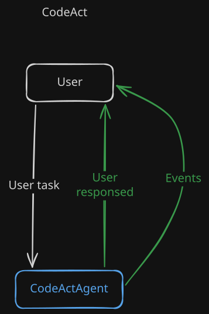
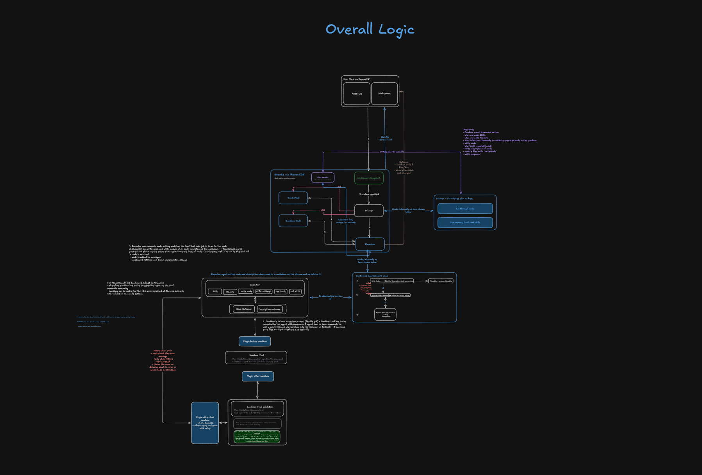

# CodeAct

### Preview Simplified


### Detailed work schema


## HITL (Human-In-The-Loop)
Use human in the loop with `CodeAct` to give to user acceptance possibility

[Check more about HITL Here](../../hitl/README.md)

```typescript
import { ReActAgent } from "@ravenlens/raven-adk/agents";
import { CodeActAgent } from "@ravenlens/raven-adk/code";
import {
	AutoPilotHITL,
	HITLLocalAdapter
} from "@ravenlens/raven-adk/tools/hitl";

const hitlAdapter = new HITLLocalAdapter((correlationId, request) => {
	// Forward the request to the CodeAct UI through IPC, a webview bridge, or another local channel.
	ui.send({ id: correlationId, request });
});

const judgeAgent = new ReActAgent({
	model,
	systemPrompt: "Judge whether proposed coding-agent actions need human approval.",
	messages: [],
	tools: []
});

const autoPilotHITL = new AutoPilotHITL(judgeAgent, {
	adapter: hitlAdapter,
	toolsUsage: {
		execute_command: { delayMs: 30_000, defaultAnswer: "deny" },
		write_file: true,
		read_file: true
	}
});

const codeAct = new CodeActAgent({
	pattern: "codeact",
	model,
	systemPrompt: "Implement the requested change and validate the result.",
	workspaces: {
		list: [{
			workspaceId: "project",
			root: process.cwd(),
			workerIsolation: "snapshot",
			applyMode: "serialized"
		}],
		accessBeyondList: false,
		listErrorStrategy: "stop"
	},
	writeMode: "proposal",
	tools: codingTools,
	memory: codingMemory,
	sandboxes: {
		default: nodeSandbox,
		byLanguage: {
			typescript: nodeSandbox,
			javascript: nodeSandbox,
			python: pythonSandbox
		}
	},
	validationCommands: {
		adjustCommandsToResult: true,
		preConfiguredCommands: [
			{ name: "tests", command: "npm", args: ["test", "--", "--run"] }
		]
	},
	hitlConfig: {
		hitl: autoPilotHITL,
		hitlPreConfig: {
			hitlStrategy: "use-hitl",
			triggerOnDefaultCodeActTools: true,
			triggerOnRetry: true,
			allowToAskQuestions: true
		}
	}
});

```

`model`, `codingTools`, `codingMemory`, `nodeSandbox`, `pythonSandbox`, and
`ui` are application-provided values. With `hitlStrategy: "use-hitl"`, CodeAct
uses the configured `AutoPilotHITL` instance when a default CodeAct operation,
retry, or configured tool requires a decision. AutoPilot evaluates the tool
and its parameters first: clearly safe actions can be omitted from the human
approval flow, while risky or ambiguous actions are sent to the UI through the
adapter. The UI must answer with `allow` or `deny` using the request's
correlation id.

> We higly recomend to use [AutoPilotHITL](../../hitl/AutoPilotHITL.md)
