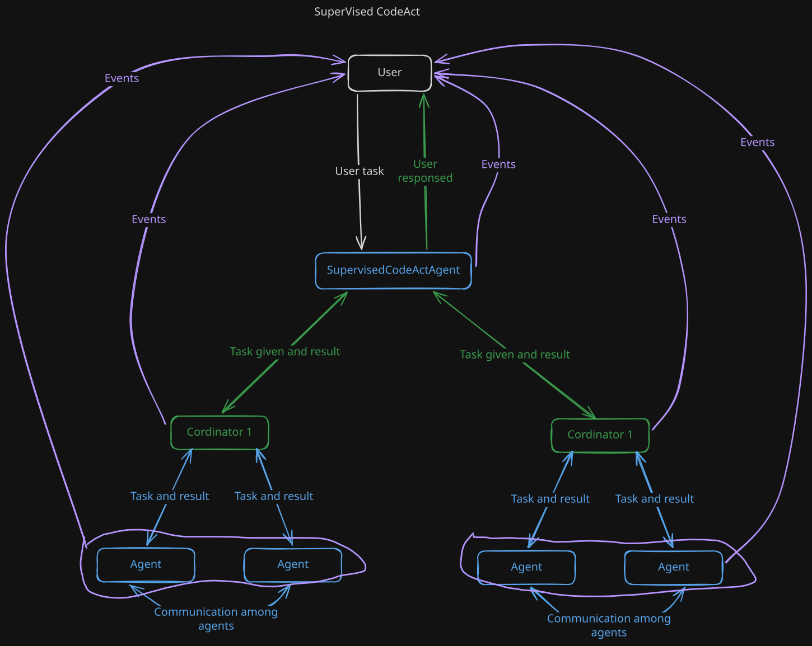

# SupervisedCodeAct

### Preview Simplified

- Supervisor criticues and delegates the tasks to headless and coordinated groups
- Among groups agents can communicate to accomplish the tasks - this significantly improves results upgrading by handoff caoapbility