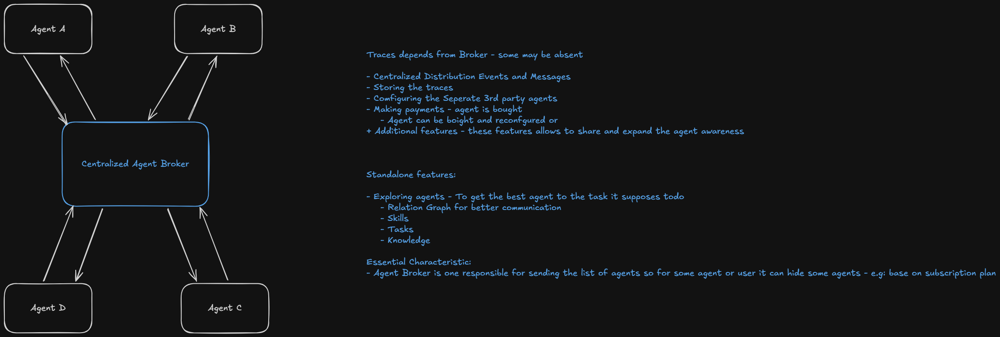
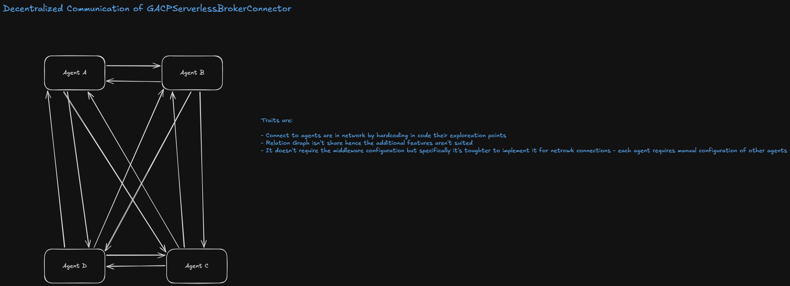

# GACP (Graph Agent Communication Protocol)

GACP is a next-generation protocol designed for seamless communication within agentic meshes (heerds/bevies). It enables flexible task delegation in both **synchronous and asynchronous** manners, optionally supported by an intelligent queuing system. Unlike traditional agent communication protocols (like A2A or ACP) that focus primarily on direct task delegation, GACP treats agents as part of a dynamic, knowledge-rich graph where skills and insights are shared, traded, and discovered. Tasks can be divided to small pieces and send to multiple different specialized agents, send as full-task to one-specialized agent or get knowledge, tools and skills from specific agent and perform the task by itself.

## Why GACP?
Traditional protocols often operate on a request-response or simple task delegation model. GACP evolves this by introducing:

- **Advanced Knowledge Sharing**: Agents don't just delegate; they share their inner reasoning and accumulated knowledge.
- **Resource Marketplace**: Agents can "buy" or "take for free" specialized skills and knowledge from an Orchestrator or other agents, rather than just offloading a manual task.
- **Protocol Flexibility**: Support for both high-performance centralized brokers (MQTT) and secure, peer-to-peer serverless connections (WebRTC).

## Core Concepts

### 1. Knowledge & Skills Sharing
In GACP, knowledge isn't trapped within a single agent's context. 
- **Knowledge Acquisition**: An agent can query the network for specific files, data, or reasoning traces.
- **Skill Discovery**: Instead of just doing a task, an agent can "upgrade" its capabilities by fetching tools or skills from the environment.
- **Orchestrator-Mediated**: The "Orchestrator" (Broker) acts as a repository where knowledge can be offered for free (community/org shared) or via a payment model.

### 2. The Orchestrator (Broker)
The Orchestrator is the brain of the network, enabling advanced enterprise features:
- **Knowledge Visualization**: Manage and explore silos of agent knowledge in one place.
- **Constrained Access**: Providers can restrict a user's access to specific subsets of agents based on subscription levels.
- **Marketplace**: Access a market of community-shared or organization-specific agents.
- **Privacy & Security**: Secure knowledge distribution via the concept of **Replication**.

### 3. Flexible Delegation Modes
GACP supports multiple ways to hand off work between agents:
- **Synchronous Delegation**: Ideal for immediate tasks where the caller waits for a direct response or confirmation.
- **Asynchronous Delegation**: Suited for long-running processes where the agent acknowledges receipt and reports progress/completion via events.
- **Optional Queuing**: Delegation can be enhanced with an optional queue, allowing agents to manage backlogs without losing task state.

### 4. Asynchronous Task Queuing & Throughput
GACP manages agent capacity through a structured queuing system:
- **Defined Throughput**: Each agent can define its maximum concurrent task capacity.
- **Task Queuing**: When an agent hits its throughput limit, incoming tasks are automatically placed in a queue.
- **Availability Exploration**: Agents can check the current load and queue length of other agents before delegating.
- **Non-Blocking Delegation**: Even if an agent is busy, a task can be sent to its queue. The caller and user are notified that the task is "Queued," allowing them to continue other work or wait for a completion event.
- **Status Notifications**: Real-time feedback on queue position and estimated processing time (where supported by the broker).

## Architecture & Connectors

GACP defines two primary ways for agents to interact:

### Middleware Server Connector (`GACPMiddlewareBrokerConnector`)

*   **Protocol**: Based on `MQTT`.
*   **Characteristics**: Blazing fast pub/sub, centralized event distribution, and trace storage.
*   **Best For**: Environments requiring a central marketplace, payments, and global agent exploration.

### Serverless Connector (`GACPServerlessBrokerConnector`)

*   **Protocol**: Based on `WebRTC Data Channels`.
*   **Characteristics**: Fully encrypted peer-to-peer communication.
*   **Best For**: High-privacy environments where agents communicate directly without middleware. Requires manual configuration of agent URLs/points.

## Quick Start (User Friendly)

Setting up a GACP-enabled agent is straightforward. Below is an example of an agent that plays music and shares its specialized tools with others in the network.

```typescript
import { GACPAgent, GACPMiddlewareBrokerConnector } from "./src/gacp/client";

// 1. Initialize the connector to your GACP Broker
const connector = new GACPMiddlewareBrokerConnector("https://gacp-broker.io");

// 2. Define your Agent
const musicAgent = new GACPAgent(
    {
        name: "MusicPlayer",
        description: "Specialized in high-fidelity music playback",
        specialization: ["audio-streaming", "playlist-management"],
        agentBox: async (agentInterface) => {
            // Listen for tasks delegated from other agents
            agentInterface.onEvent("delegate_task", (toAgent, task) => {
                console.log(`Executing delegated task: ${task}`);
            });

            return {
                async invoke(task, caller) {
                    // Logic to play music
                    return true;
                },
                getSkills(caller) {
                    return ["play", "stop", "shuffle"];
                },
                getTools(caller) {
                    return [{ name: "volume-booster", version: "1.0.0" }];
                },
                getKnowledge(caller) {
                    // Share playlist history or music metadata
                    return { genre: "Lo-Fi", mood: "Focused" };
                }
            };
        }
    },
    connector,
    { userId: "user_123" } // Action Identifier for attribution
);
```

## Benefits for Organizations
- **Cross-App Collaboration**: Connect agents from different apps to form a cohesive ecosystem.
- **Task Acceleration**: Background sub-tasking and shared reasoning traces speed up complex processing.
- **Cost Efficiency**: Reuse skills across the organization instead of re-training or re-implementing logic for every new agent.

