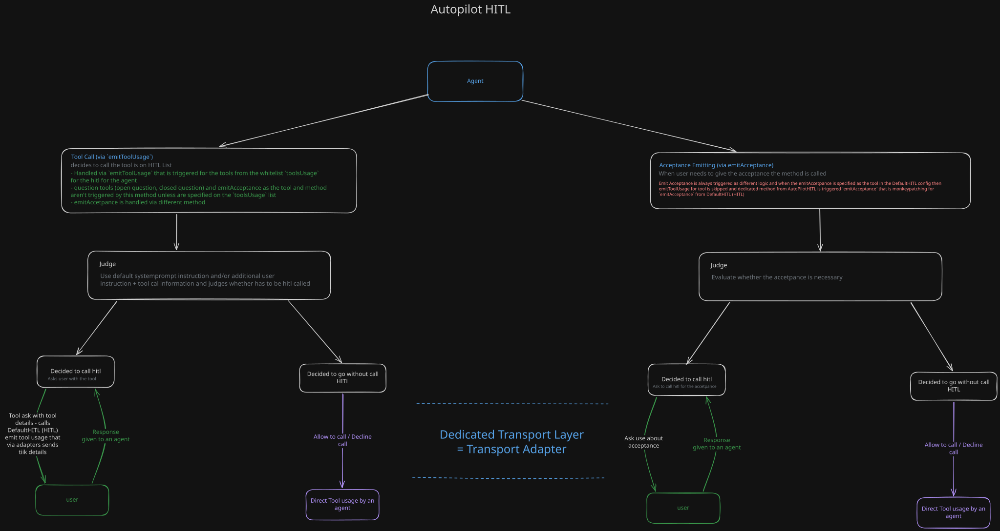

# AutoPilot HITL

`AutoPilotHITL` is the judge-assisted HITL strategy. It extends the default
`HITL` implementation and still satisfies RavenADK's common
`HITLTransportSchema`, so it can be passed to `ReActAgent` anywhere a regular
`HITL` instance is accepted.

AutoPilot uses the same adapter contract and request/response protocol as the
default strategy. See [Transport.md](Transport.md) for the `HITLAdapter`
interface, transport events, correlation ids, and custom adapter guidance.

## Work Drawning


## How It Works

For each proposed tool invocation, AutoPilot:

1. Sends the tool definition and its invocation parameters to a judge agent.
2. Expects the structured result `use-hitl` or `omit`.
3. Calls the regular HITL approval flow only for `use-hitl`.
4. Returns a schema-compatible denial for `omit`, so the tool is not executed.

The judge is instructed to require approval for destructive, irreversible,
security-sensitive, privacy-sensitive, financially consequential,
externally-visible, or ambiguous actions. You can provide an additional
instruction for a particular judgement through `emitToolUsageAutoPilot`.

## Which Tools AutoPilot Judges

`toolsUsage` is the allowlist that causes the built-in `ReActAgent` flow to call
`emitToolUsage()` for a tool. With `AutoPilotHITL`, that method delegates to
the AutoPilot judge. Only tools named in `toolsUsage` enter this ordinary
approval path; the judge does not inspect every tool in the agent's `tools`
array automatically.

Question tools are a separate path. Enabling `questions.abcQuestion` or
`questions.openQuestion` injects the corresponding question tool, whose handler
calls `emitAbcQuestion()` or `emitOpenQuestion()` directly. AutoPilot does not
judge these calls through `emitToolUsage()`, and this is intentional: the tool
itself is already the mechanism for asking the user. A judge result of
`"omit"` would otherwise be interpreted as a denial and could prevent the
agent from collecting required information.

Do not add `hitl_ask_abc_question` or `hitl_ask_open_question` to `toolsUsage`.
Doing so can cause an approval prompt before the actual question and does not
turn AutoPilot into a question-necessity judge.

## Why Question Tools Bypass The AutoPilot Judge

Question tools have a different contract from ordinary tools. An ordinary tool
produces an action that may need approval; `hitl_ask_abc_question` and
`hitl_ask_open_question` are already explicit requests for missing information
from the user. Their handlers call `emitAbcQuestion()` or `emitOpenQuestion()`
and the answer becomes part of the agent's next context.

For that reason, AutoPilot should not invoke a separate ordinary-tool judge for
these question calls. Doing so would create a misleading sequence:

```text
question tool -> AutoPilot judge -> tool-approval -> user question
```

It can also turn a judge result of `omit` into a denial of the question tool,
so the agent never receives information it explicitly requested. Listing a
question tool in `toolsUsage` therefore creates an unnecessary two-interaction
flow and does not provide a reliable test of whether the question is needed.

AutoPilot also should not silently answer the question on the user's behalf as
part of that evaluation. The purpose of a question tool is to obtain
user-owned intent, knowledge, or confirmation. A judge may be able to predict
an answer, but prediction is not equivalent to asking the user and can hide an
important ambiguity or consent boundary. The normal AutoPilot behavior is to
let the agent decide to ask, then send the question request to the user and
return the actual answer to the agent.

> **Feature Possibility:** An integration that deliberately wants judge-mediated clarification may build
a separate, explicitly documented workflow around its own judge tool. That is
not the semantics of the built-in question tools and should not be enabled by
putting them in `toolsUsage`. Such a workflow must define how it distinguishes
a judge-generated answer from a user answer, how it handles uncertainty, and
which decisions still require the user.

## Acceptance Requests

AutoPilot supports acceptance through both the inherited
`emitAcceptance(question, context?)` method and the optional
`HITL_ACCEPTANCE_TOOL_NAME` tool (`"hitl_ask_acceptance"`). Enable the tool in
the shared configuration when the agent should be able to request acceptance
itself:

```typescript
const hitl = new AutoPilotHITL(judgeAgent, {
	adapter: hitlAdapter,
	accetpanceAsTool: {
		instruction: "Ask for explicit approval immediately before a risky action.",
		delaysMs: 30_000,
		// Or just "deny", use function to return the answer for the acceptance regar its answer - you can use there other agent or llm to compose answer from the knowledge base
		defaultAnswer: () => "deny"
	},
	engageJudgeInEmittingAccetpance: true
});
```

The `engageJudgeInEmittingAccetpance` setting is optional and applies to the
separate `emitAcceptance` method. When it is disabled or omitted,
`emitAcceptance` delegates directly to the inherited Default HITL request
flow. When it is enabled, AutoPilot temporarily prepares its judge agent with
the acceptance question, context, and optional instruction. The judge returns
`"use-hitl"` or `"omit"`; only `"use-hitl"` calls the inherited
`emitAcceptance`, while `"omit"` returns `"deny"` without contacting the human
adapter. The judge agent's previous messages are restored afterward.

When the acceptance judge returns `"use-hitl"`, the inherited acceptance flow
uses `accetpanceAsTool.delaysMs` and its `defaultAnswer` callback. Human
inactivity can therefore resolve the request as `allow` or `deny`. If the
judge returns `"omit"`, no human request is sent and the configured inactivity
fallback is not involved. The same inherited timeout behavior applies to the
configured question tools; those tools do not enter the ordinary AutoPilot
judge path.

The acceptance tool follows a deliberately different path. Its handler calls
`emitAcceptance` directly. AutoPilot's `emitToolUsage` detects
`HITL_ACCEPTANCE_TOOL_NAME` and does not call `emitToolUsageAutoPilot`, so the
normal tool-usage judge is not run for the acceptance tool. If the acceptance
tool is listed in `toolsUsage`, however, this special branch returns a denial
before the tool handler executes. The user therefore receives no acceptance
request; it does not create two acceptance interactions.

This avoids spending an additional judge invocation, tokens, and latency on a
request that already has dedicated acceptance logic. For that detection,
`emitToolUsage` returns:

```typescript
{
	answer: "deny",
	reason: "accetpance_separate_logic"
}
```

The denial is a routing result for the acceptance tool, not the user's
acceptance answer. Do not add `hitl_ask_acceptance` to
`toolsUsage`; `accetpanceAsTool` enables it, and
`engageJudgeInEmittingAccetpance` controls the optional dedicated acceptance
judge. With the recommended configuration, the tool calls
`AutoPilotHITL.emitAcceptance()` directly. If the dedicated acceptance judge
is enabled, its `use-hitl` result sends one acceptance request to the user;
its `omit` result returns `deny` without contacting the user.

If `hitl_ask_abc_question` or `hitl_ask_open_question` is added to
`toolsUsage`, AutoPilot first invokes its ordinary tool judge. When the judge
returns `use-hitl`, the user receives a `tool-approval` request and, after
allowing it, the question tool sends its actual `abc-question` or
`open-question` request. This creates two user interactions and is normally
unnecessary. When the judge returns `omit`, the question tool is denied and
the actual question is never sent.

## Judge Prompt Configuration

`AutoPilotHITLConfig` extends `HITLConfig` with three fields that are specific
to the AutoPilot judge. They control the prompts sent to the judge agent for
each tool invocation:

| Field | Effect |
|---|---|
| `hitlJudgeSystemPromptExtension` | Appends the supplied text to the built-in safety-judge system prompt. Use this to add policy or domain-specific guidance while retaining the default instructions. |
| `hitlJudgeSystemPromptReplacement` | Replaces the built-in system prompt completely with the supplied text. When both system-prompt fields are provided, replacement takes precedence and the extension (`hitlJudgeSystemPromptExtension`) is ignored. |
| `hitlJudgeUserMessagePromptExtension` | Appends the supplied text to the generated user message after the tool definition, argument and output schemas, invocation parameters, and optional `instructionForActionJudegement`. |

For every judgement, AutoPilot first builds the default system prompt and the
structured user message. The system prompt then applies
`hitlJudgeSystemPromptReplacement` if it is set; otherwise it appends
`hitlJudgeSystemPromptExtension` when that is set. The user-message extension
is applied separately and does not replace the generated tool context. These
fields affect only the judge prompts; the regular HITL configuration, such as
`toolsUsage`, still controls which tools can enter the approval flow and how
approval is handled after the judge returns `use-hitl`.

## AutoPilot HITL Events

`AutoPilotHITLEvents` is the event map used by an `AutoPilotHITL` instance. It
extends `HITLEventsSpecType` and `DefaultHITLEvents`, so AutoPilot exposes all
of the standard HITL events in addition to its dedicated judge events.

The standard HITL events are:

| Event | Emitted by | Event body |
|---|---|---|
| `hitl_start` | The inherited approval, question, or acceptance flow | `() => void` |
| `hitl_end` | The inherited flow when it finishes | `() => void` |
| `hitl_request_sent` | The inherited request dispatch | `(id: number, request: HITLRequest) => void` |
| `hitl_response_received` | The inherited response handler | `(correlationId: string \| number, response: HITLResponse) => void` |
| `hitl_delay_passed` | The inherited tool approval timeout | `(toolName: string, details: { defaultAnswerUsed: boolean; defaultAnswer?: "allow" \| "deny" }) => void` |
| `hitl_acceptance_started` | The inherited `emitAcceptance` flow before its request is sent | `(question: string) => void` |
| `hitl_acceptance_received` | The inherited `emitAcceptance` flow after its response is received | `(question: string, answer: "allow" \| "deny") => void` |

The AutoPilot-specific events are:

| Event | Emitted by | Event body |
|---|---|---|
| `autopilot_judge_started` | `emitToolUsageAutoPilot` when judging starts | `(tool: HITLToolInstanceProbe) => void` |
| `autopilot_judge_finished` | `emitToolUsageAutoPilot` when judging finishes | `(tool: HITLToolInstanceProbe, outcome: "use-hitl" \| "omit") => void` |

`emitToolUsageAutoPilot` emits the judge events and, when the outcome is
`"use-hitl"`, delegates to the inherited approval flow, which emits the
standard HITL events. The common `emitToolUsage` method delegates to
`emitToolUsageAutoPilot`, so callers using that method can observe the same
event sequence. An outcome of `"omit"` returns the schema-compatible denial
without entering the human approval flow.

Acceptance has its own event sequence. `emitAcceptance` emits
`hitl_acceptance_started(question)` before the `acceptance` request is sent and
`hitl_acceptance_received(question, answer)` after the response is received.
It also emits the shared `hitl_start` and `hitl_end` events. With
`engageJudgeInEmittingAccetpance` enabled, the AutoPilot judge runs before
these inherited human-flow events; an omitted request emits no acceptance
request or inherited acceptance response event because no human interaction
occurs. With the acceptance tool enabled, the tool invocation itself is still
an agent tool call, but its HITL approval routing is intentionally excluded
from the normal AutoPilot judge as described above.

Listen directly on the concrete `AutoPilotHITL` instance:

```typescript
// Use onEvent for one dedicated AutoPilot event.
autoPilotHITL.onEvent("autopilot_judge_finished", (tool, outcome) => {
	console.log("AutoPilot judge finished", tool.toolInstance.toolConfig.toolName, outcome);
});

// Use onAnyEvent to observe both AutoPilot judge events and inherited HITL events.
autoPilotHITL.onAnyEvent((eventName, ...args) => {
	console.log("AutoPilot HITL event", eventName, args);
});
```

See [HITL Events](README.md#hitl-events) for the generic event API and the
`onEvent`, `onAnyEvent`, and `emitEvent` methods shared by HITL strategies.

## When to use It
- When most of actions aren't very serious in consequences therefore can be implement with agent that auto-evaluates what should be auto-aporved and what send for human feedback
- When you don't know what tool has to get the approval
- When different parameters given to tools have different level of seriousness, some can be less volatille some are more serious or horrific - Auto-HITL can establish rules where low-volatile actions are autoAproved and more volatile are thrown for human evaluation.
    - To tune additionally the agent evalutation specify `instructionForActionJudegement` parameter when calling `emitToolUsageAutoPilot` method
    > This is only one method supports the `instructionForActionJudegement` where `emitToolUsage` hasn't such tunning oppurtunity, therefore all base on a fundamental static prompt given to m

## Usage
- [CodeAct](../code/CodeAct.md) - coding agents can leverage `AutoPilotHITL` to decide whether a command, file I/O operation, or another action should run automatically or be delegated for human approval. This avoids continuous approval prompts for clearly safe actions.
```typescript
import { ReActAgent } from "@ravenlens/raven-adk/agents";
import { CodeActAgent } from "@ravenlens/raven-adk/code";
import {
	AutoPilotHITL,
	HITLLocalAdapter
} from "@ravenlens/raven-adk/tools/hitl";

const hitlAdapter = new HITLLocalAdapter((correlationId, request) => {
	// Forward this message to the CodeAct UI, for example through Electron IPC.
	ui.send({ type: "hitl:request", id: correlationId, request });
});

const judgeAgent = new ReActAgent({
	model,
	systemPrompt: "Judge whether proposed coding-agent actions need human approval.",
	messages: [],
	tools: []
});

const autoPilotHITL = new AutoPilotHITL(judgeAgent, {
	adapter: hitlAdapter,
    // Use `toolsUsage` to specify the list with tools for that AutoPilotHITL triggers logic of evaluation and human pass
	toolsUsage: {
		execute_command: { delayMs: 30_000, defaultAnswer: "deny" },
		write_file: true,
		read_file: true
	}
});

const codeAct = new CodeActAgent({
	pattern: "codeact",
	model,
	systemPrompt: "Implement the requested change and validate the result.",
	workspaces: {
		list: [{
			workspaceId: "project",
			root: process.cwd(),
			workerIsolation: "snapshot",
			applyMode: "serialized"
		}],
		accessBeyondList: false,
		listErrorStrategy: "stop"
	},
	writeMode: "proposal",
	tools: codingTools,
	memory: codingMemory,
	sandboxes: { default: nodeSandbox },
	validationCommands: {
		commands: [{ name: "tests", command: "npm", args: ["test", "--", "--run"] }],
		maxRepairAttempts: 2
	},
	hitlConfig: {
		hitl: autoPilotHITL,
		hitlPreConfig: {
			hitlStrategy: "use-hitl",
			triggerOnDefaultCodeActTools: true,
			triggerOnRetry: true,
			allowToAskQuestions: true
		}
	}
});

```

- `model`, `codingTools`, `codingMemory`, `nodeSandbox`, and `ui` are
application-provided values. When CodeAct proposes a configured action,
`AutoPilotHITL` evaluates the tool definition and parameters first. Only when
the judge returns `use-hitl` does the request reach the UI for approval. A
judge result of `omit` returns a denial through the common HITL schema without
asking the user. This snippet documents the current CodeAct configuration
contract; `CodeActAgent.invoke` is not implemented yet.
- `toolsUsage` - is specified as config param to `AutoPilotHITL` method and it has to have the list with tools for that HITL is triggered. **Only for that list HITL is going to be triggered**
- Question tools configured through `questions` are not part of this list and
	are handled directly as user-information requests.

## Convergence

Some RavenADK integrations do not yet comply with the newer AutoPilot HITL
standard. In particular, `ReActAgent` currently calls the common
`emitToolUsage` method through `HITLTransportSchema`; it does not yet call the
dedicated AutoPilot judgement method. This keeps the existing agent logic
compatible with the common HITL contract, but it means that the ReActAgent
path does not explicitly express the newer AutoPilot convention.

CodeAct uses `emitToolUsage` as a convergence point for the typical RavenADK
HITL schema and its existing execution logic. This wrapper is needed for the
common agent-facing contract and for scenarios where an integration expects a
standard `HITLTransportSchema` implementation. Newer integrations that adopt
AutoPilotHITL as the standard should use the dedicated
`emitToolUsageAutoPilot` method instead. That method exposes the judge outcome
(`use-hitl` or `omit`) and allows callers to provide AutoPilot-specific
judgement options, including an instruction and error behavior.

The two entry points therefore serve different compatibility levels:

| Entry point | Intended role |
|---|---|
| `emitToolUsage` | Common, schema-compatible wrapper used by existing RavenADK agent logic and CodeAct convergence scenarios. |
| `emitToolUsageAutoPilot` | Dedicated API for newer integrations that explicitly use the AutoPilot judge standard. |


## Setup

The constructor receives a judge `ReActAgent` and the same configuration used
by `HITL`. The adapter can be local or network-based:

```typescript
import { ReActAgent } from "@ravenlens/raven-adk/agents";
import { AutoPilotHITL, HITLSocketIoAdapter } from "@ravenlens/raven-adk/tools/hitl";

const judgeAgent = new ReActAgent({
	model,
	systemPrompt: "You are a safety judge.",
	messages: [],
	tools: []
});

const hitl = new AutoPilotHITL(judgeAgent, {
	adapter: new HITLSocketIoAdapter({ port: 3000 }),
	toolsUsage: {
		delete_account: true,
		transfer_money: { delayMs: 30_000, defaultAnswer: "deny" }
	}
});

const agent = new ReActAgent({
	model,
	systemPrompt: "You are a careful assistant.",
	messages: [{ type: "user", content: "Handle my request safely." }],
	tools,
	hitl
});
```

The adapter receives the same rich tool-approval payload as the default
strategy, including `toolName`, `toolInstance`, and `params`. See
[Transport.md](Transport.md) for all request and response types,
[SocketHITL.md](SocketHITL.md) for the client response handler, or
[LocalHITL.md](LocalHITL.md) for a local bridge.

## Direct Judge API

Use `emitToolUsageAutoPilot` when the caller needs to inspect the judge result
directly or provide a custom error policy:

```typescript
const result = await hitl.emitToolUsageAutoPilot(
	{ toolInstance: transferMoneyTool, params: { amount: 100, currency: "USD" } },
	"throw",
	"Require approval for transfers above the user's configured limit."
);

if (result.judgeEffect === "use-hitl") {
	const approval = await result.toolUsageBody;
	// approval is the regular HITL result after the user or timeout responds.
} else {
	// The judge omitted HITL; the tool must not be executed by the caller.
}
```

The common `emitToolUsage` method is the wrapper used by RavenADK's normal
agent logic. When the judge returns `use-hitl`, it returns the regular approval
result (`allow` or `deny`, with `user_answer` or `delay_pass`). When the judge
returns `omit`, it returns `{ answer: "deny", reason: "user_answer" }` as a
schema-compatible fallback; `user_answer` does not mean that the user replied.

## Judge Errors

`emitToolUsageAutoPilot` defaults to `console.error`, which treats a judge
failure as `omit`. Pass `"throw"` when a judge failure should abort the caller
instead. The convenience `emitToolUsage` wrapper uses the default behavior.

## Creating An AutoPilot-Compatible HITL

A custom HITL strategy is AutoPilot-compatible when it preserves the common
`HITLTransportSchema` contract and the AutoPilot judge contract. This lets it
be used by ordinary agent logic through `emitToolUsage()` and by integrations
that need the explicit AutoPilot result through `emitToolUsageAutoPilot()`.

The compatibility requirements are:

- Accept an `HITLConfig`-compatible configuration with an `HITLAdapter`,
  including `toolsUsage`, question configuration, and acceptance configuration.
- Keep `emitToolUsage(tool)` asynchronous and return
  `{ answer: "allow" | "deny", reason: ... }`.
- Implement `emitToolUsageAutoPilot(tool, errorBehaviour?, instruction?)` and
  return `{ judgeEffect: "use-hitl" | "omit", toolUsageBody? }`.
- Evaluate only tools that the owning agent or integration has selected for
  `toolsUsage`; do not automatically judge every tool in the agent's tool list.
- For `use-hitl`, use the inherited approval flow so adapter requests,
  correlation ids, timeouts, listeners, and standard events remain consistent.
- For `omit`, return a schema-compatible denial and do not execute the tool.
- Preserve `createQuestionTools()`, `emitAbcQuestion()`, `emitOpenQuestion()`,
  and `emitAcceptance()` semantics. Question tools must not be routed through
  ordinary tool judging or answered silently by the judge.
- Preserve the standard HITL events and add AutoPilot events only with the
  documented `autopilot_judge_started` and `autopilot_judge_finished` shapes
  when callers depend on them.

The following example uses a custom policy function as the judge. The policy
could call a model, a rules engine, or a remote service. It extends `HITL`
rather than `AutoPilotHITL` because the built-in judge implementation is
private; this is the compatible shape for replacing the judge while retaining
the inherited human transport and question behavior.

```typescript
import { HITL, SchemaTypes, HITLAdapter } from "@ravenlens/raven-adk/tools/hitl";

type HITLToolInstanceProbe = SchemaTypes.HITLToolInstanceProbe;
type HITLJudgeOutcome = "use-hitl" | "omit";
type AutoPilotHITLErrorBehaviour = "throw" | "console.error";
type AutoPilotToolUsageOutcome = {
	judgeEffect: HITLJudgeOutcome;
	toolUsageBody?: Promise<SchemaTypes.EmitToolUsageBody>;
};

// In a typed project, use the exported AutoPilot event and config types when
// your package version exposes them from its public barrel. This broad event
// map keeps the standalone example focused on the strategy shape.
type AutoPilotHITLEvents = SchemaTypes.HITLEventsSpecType &
	Record<string, (...args: any[]) => void>;
type AutoPilotHITLConfig = SchemaTypes.HITLConfigSchema & {
	adapter: HITLAdapter;
};

type Judge = (
	tool: HITLToolInstanceProbe,
	instruction?: string
) => Promise<HITLJudgeOutcome>;

class CustomAutoPilotHITL extends HITL<AutoPilotHITLEvents, AutoPilotHITLConfig> {
	constructor(
		config: AutoPilotHITLConfig,
		private readonly judge: Judge
	) {
		super(config);
	}

	async emitToolUsageAutoPilot(
		tool: HITLToolInstanceProbe,
		errorBehaviour: AutoPilotHITLErrorBehaviour = "console.error",
		instruction?: string
	): Promise<AutoPilotToolUsageOutcome> {
		this.emitEvent("autopilot_judge_started", tool);

		let judgeEffect: HITLJudgeOutcome;
		try {
			judgeEffect = await this.judge(tool, instruction);
		} catch (error) {
			if (errorBehaviour === "throw") {
				throw error;
			}
			console.error("CustomAutoPilotHITL judge experienced an error:", error);
			judgeEffect = "omit";
		}

		this.emitEvent("autopilot_judge_finished", tool, judgeEffect);

		if (judgeEffect === "omit") {
			return { judgeEffect };
		}

		return {
			judgeEffect,
			toolUsageBody: super.emitToolUsage(tool)
		};
	}

	async emitToolUsage(tool: HITLToolInstanceProbe) {
		// Keep the acceptance tool on its dedicated emitAcceptance path.
		if (tool.toolInstance.toolConfig.toolName === "hitl_ask_acceptance") {
			return { answer: "deny", reason: "accetpance_separate_logic" as const };
		}

		const result = await this.emitToolUsageAutoPilot(tool);
		return result.toolUsageBody
			? result.toolUsageBody
			: { answer: "deny", reason: "user_answer" as const };
	}
}
```

The custom judge must not call `emitToolUsage()` for question tools. The
question tools are injected by the inherited `createQuestionTools()` method
and call the inherited question methods directly. Likewise, acceptance should
remain on `emitAcceptance()`; if acceptance evaluation is needed, implement a
separate acceptance judge like `engageJudgeInEmittingAccetpance` rather than
feeding the acceptance tool back into ordinary tool approval.

This class is structurally compatible with the common agent contract and with
callers that require `emitToolUsageAutoPilot()`. It is not an instance of the
concrete `AutoPilotHITL` class, so code that requires `instanceof AutoPilotHITL`
must instead accept a shared interface or use the built-in class. Do not
override the adapter protocol, response correlation behavior, or request
payload shapes; those remain defined by [Transport.md](Transport.md).
