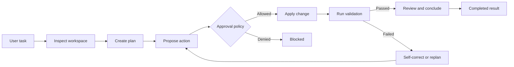

# Coding Agents Vision

Status: design document. The runtime API is not implemented yet.

This document describes what coding agents should feel like and why the two
patterns exist. The implementation contracts are defined in
[Specification.md](./Specification.md), and the implementation order is tracked
in [ROADMAP.md](./ROADMAP.md).

## Purpose

Coding agents turn a natural-language development task into an observable,
validated workspace change. The agent should be able to inspect a project,
understand its local conventions, plan a bounded set of actions, make a change,
run evidence-producing checks, and explain what happened.

The agent is not considered successful because a model wrote a confident final
sentence. It is successful when the requested change is represented as a
reviewable change set and the configured validation provides evidence for the
result.

## Design Principles

1. **Evidence over assertion.** A final result includes changed files,
   validation results, and unresolved risks.
2. **Plan before mutation.** The agent inspects the workspace and creates a
   task plan before applying the first write.
3. **One writer per workspace.** Parallel analysis is useful; concurrent writes
   to the same workspace are not safe. Workers write to isolated snapshots or
   return proposals for a serialized applier.
4. **Every action is observable.** Events identify the run, actor, task, group,
   tool, and change involved.
5. **Human control is a policy.** Human approval, deterministic autopilot
   approval, and hybrid approval are supported explicitly (both world of automatic approval and autopilot apporval are merged in hybrid approval).
6. **Reuse the ReAct foundation.** Model invocation, tools, plugins, skills,
   memory hooks, abort handling, and stream events should remain reusable from
   [ReActAgent](../ReAct.agent.ts).
7. **Graph-orchestrated execution.** The RavenADK [Graph](../../graph/index.ts)
   coordinates inspect, plan, action, validation, review, and retry stages.
8. **Small first implementation.** Advanced worker selection, replication,
   and persistent **learning are `extension points`**, not prerequisites for the
   first useful release.

## The Two Patterns

### CodeAct

CodeAct is the fast, singular-agent pattern:

- One coding agent owns the run.
- The agent cannot **hand off** work to workers or **create worker groups**.
- It may use tools, MCP servers, skills, coding memory, AST/LSP adapters, and a
  language-appropriate sandbox.
- It follows an `inspect -> plan -> act -> validate -> repair loop`.
- It is the best default for focused changes, small repositories, and quick
  feedback.

CodeAct trades some independent criticism and parallel exploration for lower
latency and simpler workspace ownership.

### SupervisedCodeAct

SupervisedCodeAct is the quality-oriented multi-agent pattern:

- A supervisor owns the objective, global plan, delegation, review, and final
  acceptance decision.
- Workers implement bounded tasks with explicit roles, responsibilities,
  tools, and path permissions.
- Independent tasks may run in parallel.
- ***Workers do not silently overwrite the shared workspace***. They return change
  sets from isolated snapshots, or a serialized applier applies approved
  changes.
- A group may have a coordinator. The coordinator may only measure and
  aggregate, or may participate in implementation when configured.
- The supervisor may send a failed task back to the same worker/worker group or choose a
  different worker/worker group.

**SupervisedCodeAct** is the best choice for broad changes, risky migrations,
cross-cutting work, or tasks where independent review is worth the added
latency and token cost.

## Shared Execution Shape



**CodeAct** uses *one agent for the whole path*. **SupervisedCodeAct** inserts task
decomposition, workers and or worker groups with given task, worker review, and an apply/merge stage between
planning and integrated validation.

## Proposed CodeAct Configuration

The following is the intended configuration shape. It is an illustrative
design example until the CodeAct package is shipped; the normative fields and
defaults are defined in [Specification.md](./Specification.md).

```ts
const codeAct = new CodeAct({
    pattern: "codeact",
    model,
    systemPrompt: "Implement the requested change and leave evidence.",
    workspaces: { // Workspaces config for the supervisor - each subagent (`worker`) has to match to the supervisor config
        accessBeyondList: true, // Default: false. Defines whether can agent access workspaces beyond the list. It'll cause hitl to be called
        list: [ // List of workspaces the supervisor has access too. **Denote:** Sub-workers and coordinators have access only to workspaces accessible by coordinator 
            { 
                workspaceId: "workspace-1",
                root: process.cwd(), // Wehre the workspace is located and its subspaces
                workerIsolation: "snapshot",
                applyMode: "serialized"
            }   
        ]
    },
    plan: {
        required: true,
        maxSteps: 12
    },
    tools: codingTools,
    mcp: [repositoryMcp, issueTrackerMcp],
    skills: codingSkills,
    memory: codingMemory,
    sandboxes: { // sandboxes have to support sandbox schema - it's compilant with RLMs codeact schema
        default: nodeSandbox,
        byLanguage: {
            python: pythonSandbox,
            typescript: nodeSandbox
        }
    },
    validation: {
        commands: [
            { name: "build", command: "npm", args: ["run", "build"] },
            { name: "tests", command: "npm", args: ["test", "--", "--run"] }
        ],
        maxRepairAttempts: 2
    },
    plugins: [/* ... Plugins list */],  // Optional. Default: undefined. Supports ReActAgent plugins full list with optionally additional invoke places and events. List with plugins will be invoked from space
    hitl: new CustomHITL() // Optional. Default: false. Used to configure the tools asks and for additional informations. TODO: Configure HITL for the CodeAct and Supervised Code act - allow to apply additional fields - or use mutually when possilbe Hitl can get the config for **validation** additionally TODO: Add Hybrid HITL with configuration
});

const result = await codeAct.invoke("Add validation for the new API response.");
```

`writeMode: "proposal"` lets an IDE show the patch before applying it.
`writeMode: "apply"` applies approved changes directly. A future transaction
mode may stage all changes and commit them atomically.

> CodeAct commits events of code producing that can be listened

## Proposed SupervisedCodeAct Configuration

Groups are first-class runtime objects. A group can run with no coordinator,
with a coordinator that only aggregates, or with a coordinator that also
participates in the work.

```ts
const supervisedCodeAct = new SupervisedCodeAct({
    pattern: "supervised-codeact",
    supervisor: {
        model: supervisorModel,
        roleDescription: "Plan, delegate, review, and accept the final change.",
        responsibilities: [
            "create the global plan",
            "assign tasks to capable workers",
            "review change sets and validation evidence",
            "request repair or replan when evidence fails"
        ]
    },
    workers: [ // Workers can be assigned only to workspaces have access When no worker has access to workspace where supervisor designates work no one worker will be assigned
        {
            id: "typescript-worker",
            subrole: "worker",
            model: workerModel,
            roleDescription: "Implement TypeScript changes and focused tests.",
            responsibilities: ["edit TypeScript", "write tests", "run focused checks"],
            tools: typescriptTools,
            allowedPathsBeyondWorkdpace: ["src", "test"], // paths extends workspace
            workspaces: { // Optional. Default: "all". Specification
                accessBeyondList: {
                    access: true // Optional. Default: true. Deterinew whether can access
                    behaviour: "HITL" // Default: undefined. Usefull when `access: true` Determine how subagent can access the workspace beyond list. Possbile Values: HITL - asks with configured hitl
                }, // Default: false. Defines whether can agent access workspaces beyond the list of supervisor - it'll producde the. Possible options: true - will access anyway with behaviour: HITL, false - no access to workspaces byond list, object - with shown confign and default `behaviour` "HITL"
                listIds: [
                    "workspace-1", // id has to match - lack of match has to cause `console.warn`. String means that all workspace `allowedWorkspaceSubspaces` are accessible
                    { // Occurance of next workspace overrides the prior one
                        id: 'workspace-1',
                        allowedWorkspaceSubspaces: [`C://workspace-path/file.md`, "C://"] // Default: undefined. As default all workspace subpaths are accessible. List with folder and files that are allowed to access only. Only specified forlder and paths can be accessed. these paths can point to workspace suboaths
                    }
                ] // Default: All workspaces from the supervisor context. Pass values of workspaces from supervisor where subagent can access only - it limits the access scope perhaps  `accessBeyondList` can successfully extend it. Possible values: string - id of workspace with full access to each folder, file, mix - you can mix values
            },
        },
        {
            id: "review-worker",
            subrole: ["worker", "cooridinator-of-workers"],
            model: reviewModel,
            roleDescription: "Review proposals and identify regressions.",
            responsibilities: ["inspect diffs", "check acceptance criteria"],
            tools: readOnlyTools,
            allowedPathsBeyondWorkdpace: ["src", "test", "documentation"]
        }
    ],
    groups: { // Config for the groups
        allowCreation: true, // Default: false, **Essential:** Whether supervisor can create new groups base on workers groups. Whithout this field supervisor cannot create group - it'll relly on yhr coordinators only
        usePredefined: false, // Default: true - whether subagent can use predefined groups
        maxParallel: 2, // number of groups can run in parallel
        communication: { // Optional. Default: undefined, Whether subagents can communicate in group. As default no agent will communicate
            enabled: true, //  Default: false. Determines whether communication in groups is allowed.
            privacy: "private-with-coordinator-and-supervisor" // Usefull only when `enabled: true`. Determines the communication visibility policy. With this option `private-with-coordinator-and-supervisor`. Sender and retriver agent and the coordinator, supervisor can view changes
        },
        replication: { // Whether groups can be replicated to run - Supervisor then compares the results and chooses this better 
            enabled: false, // Whether is enabled
            maxReplicas: 1, // Number of replica of each group e.g: 1 means in fromula: Original Group + Same Group replica x 1
            force: true // When specified each group will be replicated 
        },
        coordinator: { // Specification for coordinator of group
            enabled: true, // whether coordinator is enabled
            participates: false, // whether coordinator participates in work
            proactiveSolver: false, // whether coordinator will try to solve issue proactivelly as finds one // Default: false // When specified as `true` will try to solve the issue by `maxRepairAttempts` before delegating to the other workers to fix it
            coordinatorMaxDelegationCycles: 2, // Specified for Coordinator: maximum retries of delegation in same group before pass to supervisor - when reached result is paste to supervisor no matter of result
            workerMaxIndeoendentRetries: 2, // It's the quota of max retries the worker can try to mak to fix the error in group without communicating with other agent or supervisor - Default: 5 -
            bewareRemainingDelegationCycles: true, // Coordinator is aware how many cycles lasted what makes him potentially more deseparate to give output
        },
        preDefinedGroups: [ // Default: undefined. Optional: Pre-configgured list. When not specified 
            {
                id: "implementation-and-review",
                workerIds: ["typescript-worker", "review-worker"],
                taskIds: ["implementation", "focused-tests"]
            }
        ]
    },
    workspaces: { // Workspaces config for the supervisor - each subagent (`worker`) has to match to the supervisor config
        accessBeyondList: true, // Default: false. Defines whether can agent access workspaces beyond the list 
        list: [ // List of workspaces the supervisor has access too. **Denote:** Sub-workers and coordinators have access only to workspaces accessible by coordinator 
            { 
                workspaceId: "workspace-1",
                root: process.cwd(), // Wehre the workspace is located and its subspaces
                workerIsolation: "snapshot",
                applyMode: "serialized"
            }   
        ]
    },
    validation: { 
        adjustCommandToResult: false, // Optional. Default: true. Whether Agent can make custom command to validate the outcome. When not specified will use only the `preConfiguredCommands` or throwError, emit event or return output when config not specified
        preConfiguredCommands: [ // Optional. List with pre-configured commands. As default agent will compose and use the command for the made commits automatically - this is the 
            { name: "build", command: "npm", args: ["run", "build"] },
            { name: "tests", command: "npm", args: ["test", "--", "--run"] }
        ],
        maxRepairAttempts: 3, // Optional. Default: Infinity - agent will try till success. Important: this configuration dictates how many times **supervisor** and **worker** or **cordinator-of-workers** (itself without delegation to subworkers) tries to correct the errors captured with `custome` (`adjustCommandToResult`) or `preConfiguredCommands` before producting the error. When this quota is exceeded e.g: 3 error or outcome is thrown with the event and as the agent result base on the `attemptsExceededBehaviour`
        attemptsExceededBehaviour: "error", // Default: "result" - produces the result with indcation of attempts exceeeded- either event and otucome of agent. Possible: `error` - produces error event
    },
    // Sandboxes where code is run
    sandboxes: { // sandboxes have to support sandbox schema - it's compilant with RLMs codeact schema
        default: nodeSandbox,
        byLanguage: {
            python: pythonSandbox,
            typescript: nodeSandbox
        }
    },
    plugins: [/* ... Plugins list */],  // Optional. Default: undefined. Supports ReActAgent plugins full list with optionally additional invoke places and events. List with plugins will be invoked from space
    hitl: new CustomHITL() // Optional. Default: false. Used to configure the tools asks and for additional informations. TODO: Configure HITL for the CodeAct and Supervised Code act - allow to apply additional fields - or use mutually when possilbe Hitl can get the config for **validation** additionally TODO: Add Hybrid HITL with configuration
});

const result = await supervisedCodeAct.invoke(
    "Add the feature, tests, documentation, and a migration note."
);
```

The configuration expresses the original group concepts without making the
first implementation depend on dynamic worker creation or learned routing.

> **SupervisorCodeAct** Produces events for the code production, commands execution, delegation to worker agents and supervisor codeagents

## Roles

### Supervisor

The supervisor is the owner of the complete task. It is a:

- **Planner** that creates tasks, dependencies, acceptance criteria, and
  validation commands.
- **Delegator** that selects workers and starts independent tasks in parallel.
- **Critic and advisor** that evaluates proposals, failures, and evidence.
- **Acceptor** that decides whether the complete result satisfies the user
  request.

The supervisor may delegate a repair to the **worker (singular worker)** or **group was working on task** that made the original
mistake or to **another worker** or **working group**. *It must not accept a result without a recorded
change set and validation outcome*.

> Decision of repair is trackable - user can read whether task was delegated to the singular worker or to the group

### Worker

A worker is a configured agent with:

- A stable identifier and role description.
- A `subrole`, initially `worker` or `coordinator-of-group`.
- Responsibilities and capability restrictions.
- A task, acceptance criteria, and allowed paths.
- Access to the tools, MCP servers, skills, memory, and sandbox permitted by
  the supervisor.

A worker returns a change proposal, evidence, and blockers. It does not decide
that the global task is complete.

### Groups
Groups are a capability of `SupervisedCodeAct` only; `CodeAct` does not create or
coordinate worker groups. A group is a runtime collection of configured workers
assigned related, bounded tasks. See the [normative group
contract](./Specification.md#83-group-configuration) for the configuration
semantics.

- A group's usefulness is measured with a Q-Score. A new group starts with a
  default Q-Score of `0.5`; validated outcomes may update the score for future
  routing and group comparison.
- The supervisor may select a predefined group or create a runtime group when
  `allowCreation` is enabled. Group membership, task assignment, and global
  acceptance remain under the supervisor's authority.
- A group may run without a coordinator (headless) or with an optional group
  coordinator. In either case, workers return change sets, read-only findings,
  or evidence-backed blockers; they do not decide that the overall run is
  complete.
- Group communication is disabled by default unless
  `communication.enabled` is enabled. When enabled, messages follow the
  configured privacy policy (`all`, `private`, `private-with-coordinator`, or
  `private-with-coordinator-and-supervisor`). This policy applies to both
  coordinator-managed and headless groups. Menawhile in headless groups a `private-with-coordinator` is fruitless since there isn't coordinator nor `private-with-coordinator-and-supervisor` doesn't feature coordinator either, perhaps it shows the messages to supervisor as planned
- A coordinator may aggregate results, route group-local work, and review the
  group output. If `participates` is enabled, the coordinator may also implement
  a task, but its changes remain worker changes and require supervisor review.
- `maxDelegationCycles` bounds coordinator-driven reassignment and repair loops.
  When the limit is reached, the coordinator must stop local delegation and
  return the group result and evidence to the supervisor, marking the group. It's not supported by headless groups since there isn't coordinator and each `worker` 
  `blocked` when the work is unresolved. The supervisor may then repair,
  reassign, re-plan, accept, or block the global run.
- Groups may execute independently in isolated contexts, but accepted changes
  are reviewed and applied through the supervisor's serialized change protocol;
  workers must not silently overwrite the shared workspace.

### Group Coordinator

A group coordinator is an optional worker with group-local authority. It can:

- Collect worker results.
- Resolve group-local ordering and communication.
- Review the group result before sending it to the supervisor.
- Participate in implementation only when `participates: true`.

It cannot override the global supervisor, bypass workspace policy, or approve
its own risky external side effects.

## Changes Communication

The coding agent communicates changes in two forms:

1. **Streaming events** emitted as soon as an action or change becomes
   observable.
2. **Final result** containing the complete change inventory and validation
   evidence.

Every change event identifies the producing actor. An IDE can therefore show
worker changes separately from supervisor decisions and coordinator summaries.

```ts
{
    event: "change_proposed",
    runId: "run-42",
    actor: { id: "typescript-worker", role: "worker" },
    taskId: "implementation",
    groupId: "implementation-and-review",
    payload: {
        files: ["src/api.ts", "test/api.test.ts"],
        diff: "<unified diff>",
        baseRevision: "workspace-hash",
        status: "proposed"
    }
}
```

The final result must answer: what changed, why it changed, which checks ran,
what passed, what failed, which risks remain, and whether the change was
applied or still needs user acceptance.

## Shared Capabilities

Both patterns are convergent with the existing RavenADK foundations:

- **Tools:** read, search, patch, validation, and external tools. Independent
  tools may execute together only when their side effects are compatible.
- **MCP:** multiple MCP servers can be registered and their tools are exposed
  through the same policy and event layer.
- **Skills:** agents can discover, use, and optionally produce reusable skills
  through the CASCADE-compatible skills system.
- **Memory:** coding memory stores concepts, project relations, conventions,
  previous failures, and accepted decisions. Mixed memory can combine files,
  deterministic hooks, databases, and retrieval stores.
- **LSP and AST:** language diagnostics, symbol information, parsing, and
  structural transforms are default capability contracts even when providers
  are installed separately.
- **Sandboxes:** a default sandbox applies to all languages unless a
  language-specific sandbox overrides it. The workspace root, allowed paths,
  commands, network, timeout, and output limits are explicit.
- **HITL:** human approval, deterministic autopilot approval, or hybrid policy
  may gate risky tools, changes, package installation, network use, commits,
  and deployment.
- **Plugins:** the same lifecycle extension model as ReActAgent is available
  for run, model, worker, group, change, and validation stages.
- **Events:** all public progress is streamable and attributable.

## Future Direction

The following ideas remain part of the vision but are deliberately extension
points after the first stable execution path exists:

- Persisted worker and coordinator quality measurements using MemRL-style
  scores.
- MCTS-based worker selection that balances exploration and exploitation.
- Replicated groups whose results are compared by the supervisor.
- Dynamic group creation, eviction, and recomposition.
- Learned routing from historical project and worker outcomes.
- Persistent coding memory backed by a database or RAG store.

The first implementation should provide interfaces for these capabilities,
not require them for a basic CodeAct or SupervisedCodeAct run.
